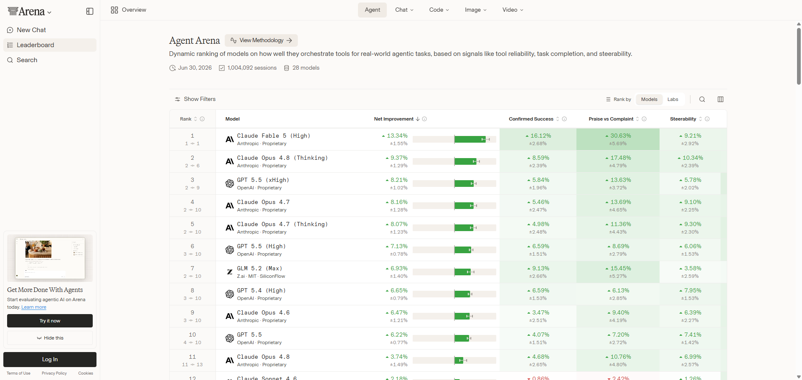
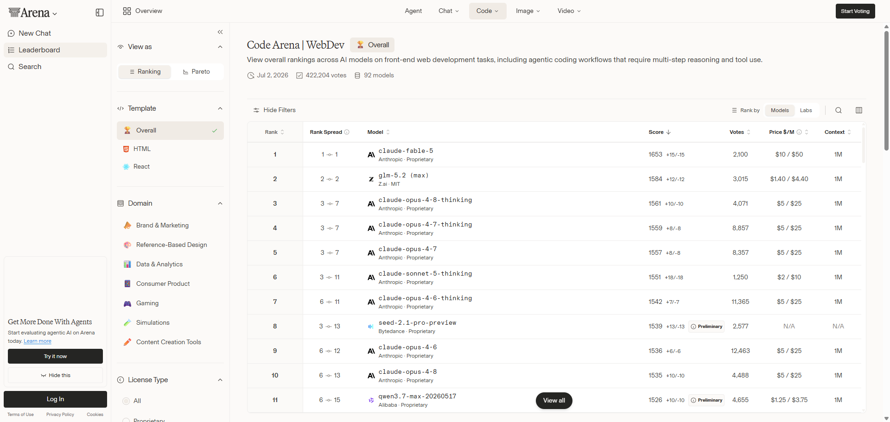
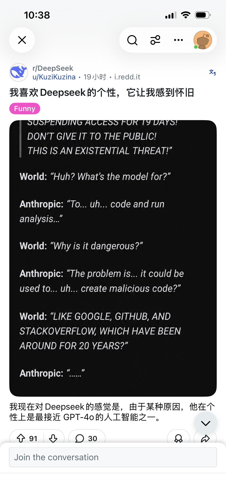
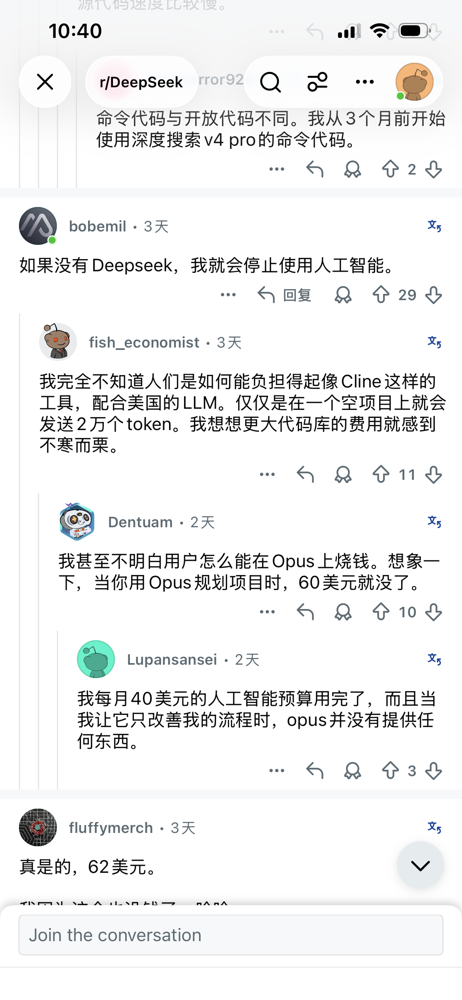
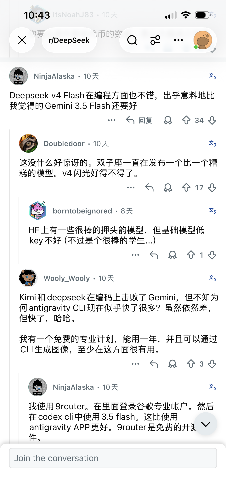
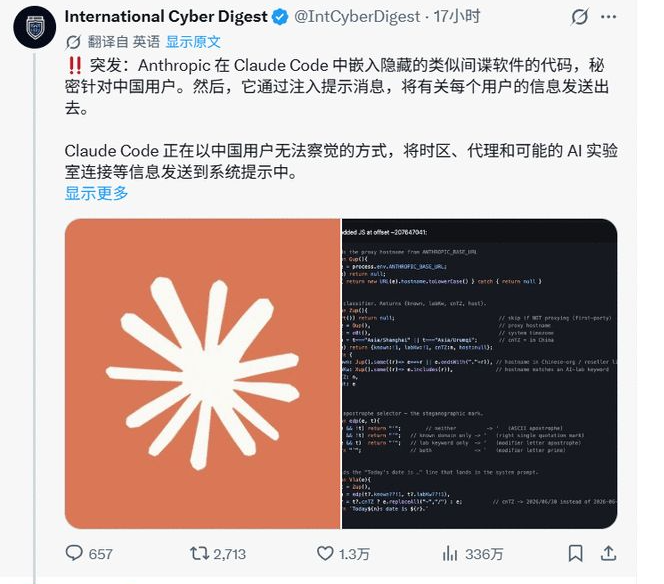
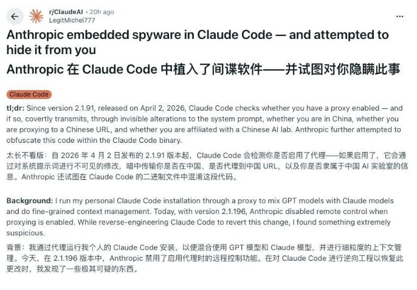

+++
date = '2026-07-03T09:47:40+08:00'
draft = false
title = '2026年AI大模型价格大比拼：Claude、GPT、GLM、DeepSeek谁最值得买？'
tags = ["AI大模型", "价格对比", "Claude", "ChatGPT", "GLM", "DeepSeek", "Gemini", "AI选购指南"]
description = '整理了2026年最新发布的GLM 5.2、DeepSeek v4、Fable 5、Sonnet 5等模型的官方价格，从代码生成、文案处理能力到综合性价比，带你了解哪家AI模型最值得入手。'
categories = ['AI相关']
+++

本篇文章汇总了各大 ai 厂商的官网价格数据，并整理了测评网站、技术论坛关于ai大模型的讨论。

方便你选择适合自己的ai大模型接口。

（目前整理的价格为 2026年7月的数据）

## 1、价格对比

### 1.1 claude

https://platform.claude.com/docs/zh-CN/about-claude/models/overview

fable 5 输入 10 美元，折合人民币 68 元；输出 50 美元，折合人民币 340 元；

sonnet 5 输入 3 美元，折合人民币 20 元；输出 15 美元，折合人民币 101 元；

### 1.2 GLM

https://bigmodel.cn/pricing

GLM 5.2 输入 8 元；输出 28 元。

### 1.3 deepseek

https://api-docs.deepseek.com/zh-cn/quick_start/pricing

deepseek v4 flash 输入 1 元；输出 2 元。

deepseek v4 pro 输入 3 元；输出 6 元。

### 1.4 chatgpt

https://openai.com/zh-Hans-CN/business/pricing/#api

GPT 5.5 输入 34 元；输出 204 元。

### 1.5 gemini

https://ai.google.dev/gemini-api/docs/pricing?hl=zh-cn#gemini-3.1-pro-preview

gemini 3.5 flash 10元；输出 61 元。

---

.png)

## 2、哪个模型能力最夯

在代码生成、文案处理以及推理这个赛道来说，Claude 公司推出的 Fable 5 模型是最强的。

在权威 ai 测评网站上，我们可以看到 Claude 模型在 web 开发领域、agent应用领域的排行榜，都位列第一的位置。

测评网站如下：

https://arena.ai/leaderboard/

https://artificialanalysis.ai/models

## 3、综合评价-谁最值得购买

### 3.1 GLM 5.2、Deepseek v4

排在第一位的是 GLM 5.2 和 Deepseek v4 模型。

原因一：价格便宜。

可以看到，这两个公司推出的模型，在使用价格方面，远低于其它模型。

.png)

原因二：GLM 5.2 模型在 ai 测评网站上的排名，较为靠前。

在 agent 应用排行榜上，GLM 5.2 排在第七位，目前仅排在Claude、GPT模型之后。

在 web 开发排行榜上，GLM 5.2 排在第二位，仅在 Claude 模型之后。

原因三：deepseek模型，在技术论坛深受好评。

在技术论坛上，可以看到很多 ai 使用者，好评 deepseek 模型的帖子。

因此，综合考虑，这两个模型，最值得购买。

### 3.2 GPT 

排在第二位的是 GPT 5.5 模型。

原因一：在ai测评榜单上，GPT模型的排名比较靠前。

原因二：OpenAI 优惠力度大。

如果不购买 api 接口，而是订阅 ChatGPT 会员，那么，OpenAI会不定期提供额度重置机会。

另外，OpenAI定期（每周）会重置账户的 token 额度。

因此，GPT 模型值得购买。

### 3.3 Claude模型

排在第三位的是，Claude fable 5 模型。

Claude公司的模型，虽然能力遥遥领先，但价格也是遥遥领先。

.png)

这家公司，前段时间还爆出了丑闻，它们在自家工具 Claude Code 中植入后门，窃听中国用户的使用情况。

这也引起了国内外网友的恐慌，大家对于 ai 工具的安全性问题提出了质疑。

如果想体验 Claude 公司的 Sonnet 5模型，建议使用[网页版](https://claude.ai/), 使用免费计划即可。

---

以上就是本期分享。