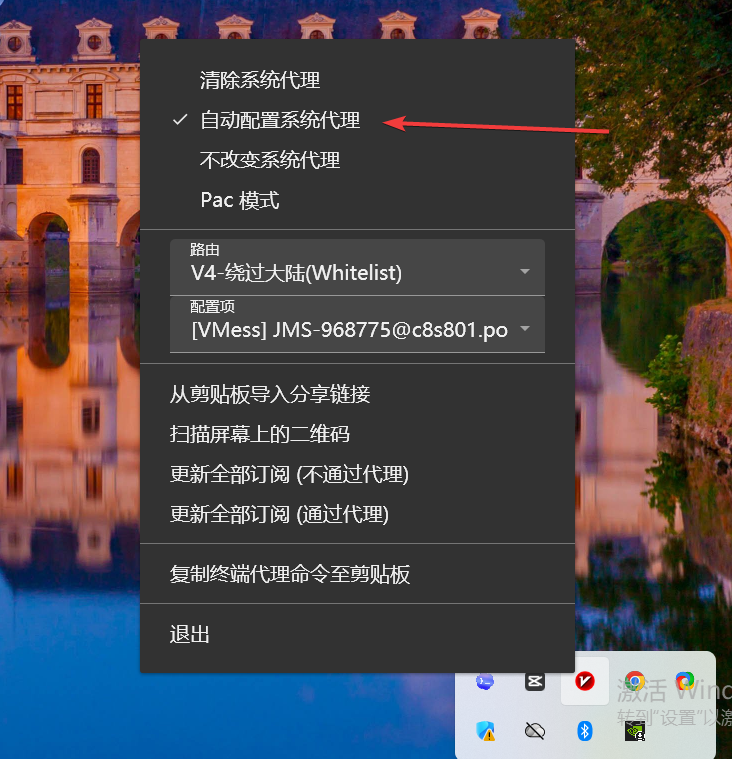
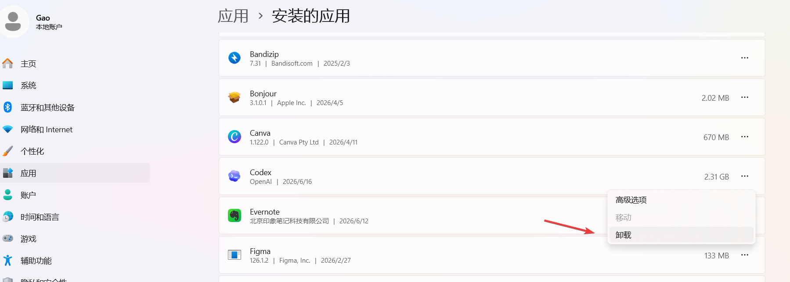
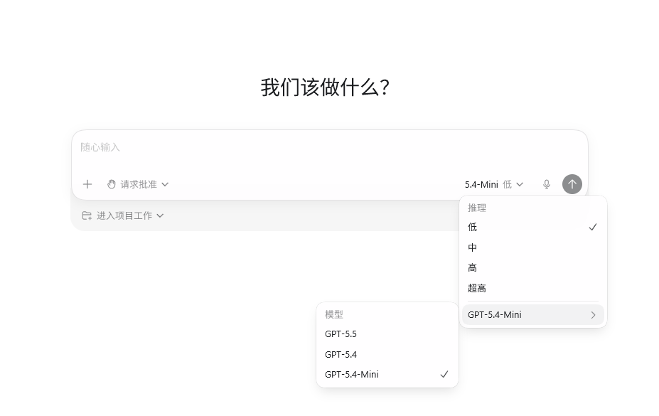
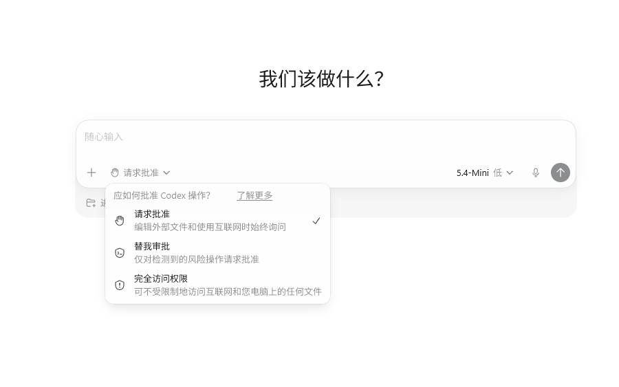
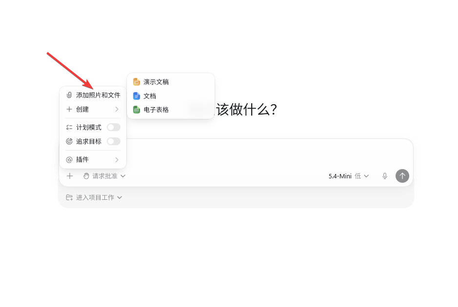
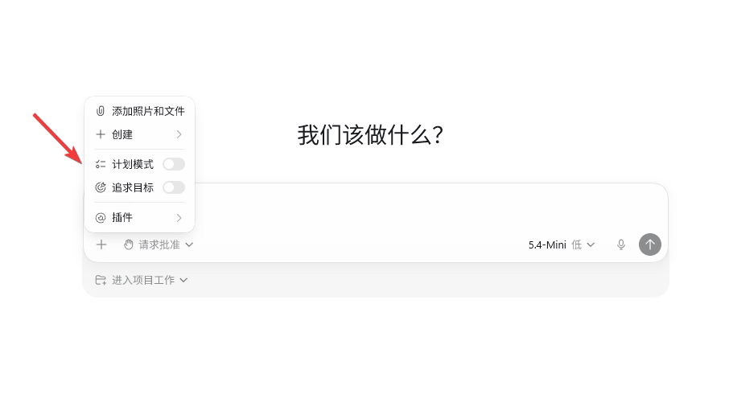
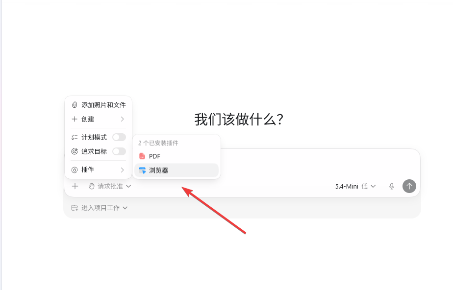
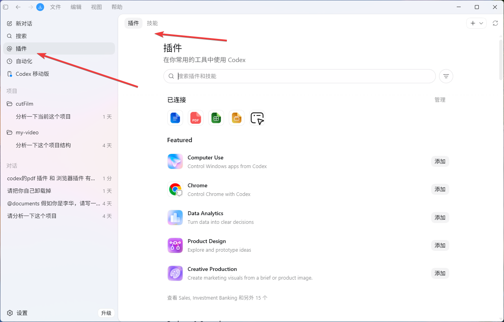
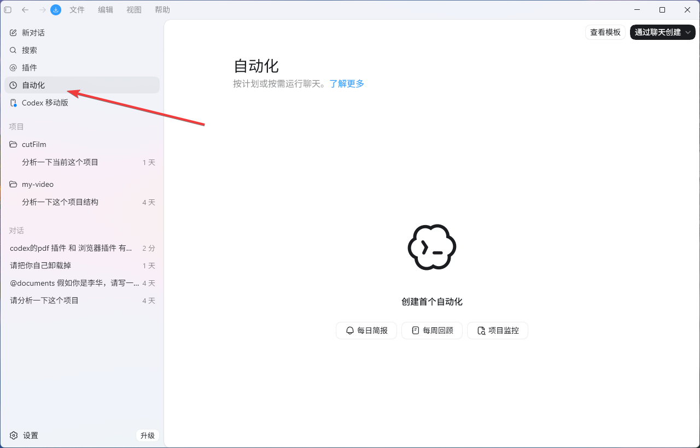
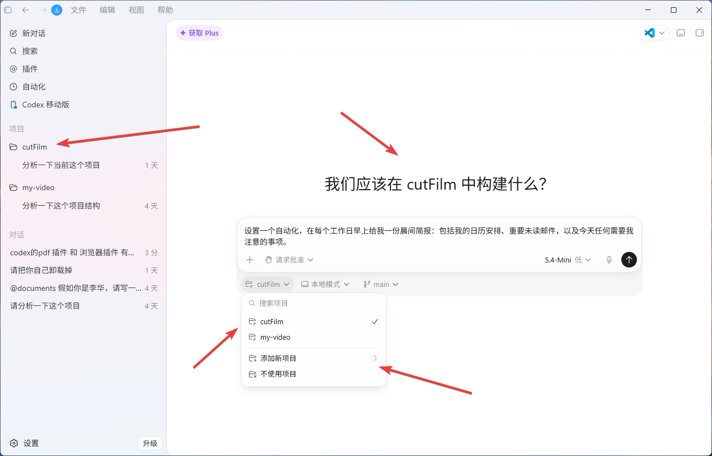

+++
date = '2026-06-11T14:44:51+08:00'
draft = false
title = 'Codex AI 完整使用教程：从下载安装到使用技巧全指南'
tags = ['Codex', 'AI工具', '人工智能', '安装教程', '使用指南', 'AI助手', '代理配置']
description = '详细介绍 Codex AI 工具的完整使用教程，包括下载安装步骤、代理配置、登录方法、权限管理和卸载流程。解决 Codex 加载不出来、登录失败、一直转圈等常见问题，帮助你快速上手这款强大的 AI 助手工具。'
categories = ['AI相关']
+++

今天盘点一下 codex 从安装、使用到卸载的各个环节，梳理一下使用 codex 的注意事项。

## 1、下载、安装、打开、卸载

[Open AI 官网](https://openai.com/zh-Hans-CN/codex/) 进行下载。

安装过程，无法自定义，安装后程序默认放在`C:\Program Files\WindowsApps\OpenAI.Codex_26.609.9530.0_x64__2p2nqsd0c76g0\app>`

注册、登录、打开应用，务必把全局代理打开，否则无法使用。

卸载codex，请点击开始-设置-应用-安装的应用-codex-卸载。

## 2、使用初体验

可以白嫖，有免费的额度，并且额度用完之后，会定期重置。

对话框右下角可以选择模型，以及推理的强度。强度越高，消耗token越多，结果越准确。

左下角，可以配置 codex 权限。

第一个选项，权限最低，每件事都会询问用户。

第二个选项，权限中等，偶尔询问用户。

第三个选项，权限最高，ai 具备增删改查能力，不会询问用户是否同意。

左下角加号这里的选项，可以创建ppt、文章、图片、文件……

这里的计划模式开启之后，ai 会先提供方案，由你决定是否执行。

这里的目标模式开启之后，ai 会一直执行提示词，直到完成为止。

浏览器插件，可以让 codex 以浏览器视角，查看网址。

pdf插件，可以让 codex 解析整理pdf文件。

左侧插件这里，可以看到更多的插件和skill。

自动化工具，可以创建定时任务，让 codex 成为你的私人助理。

对话框下侧可以选择项目，选择之后，所有的对话内容，都会以这个项目展开。

## 3、套餐订阅

套餐订阅，请看这个[视频](https://youtu.be/YveuXwYlmP8)。

视频里分享了如何在国内，通过官方渠道，订阅 codex 会员。官方渠道付费订阅，安全性更有保障。

----

以上就是本期分享，感谢阅读。