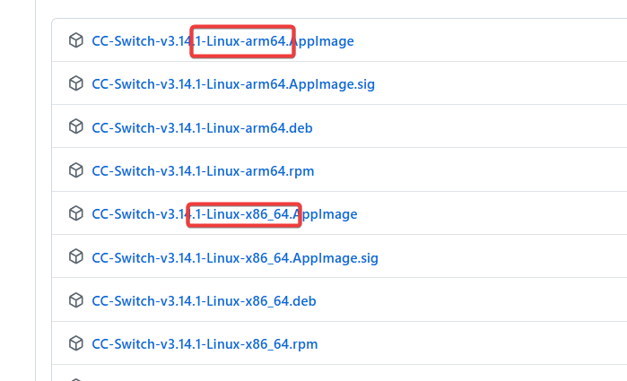
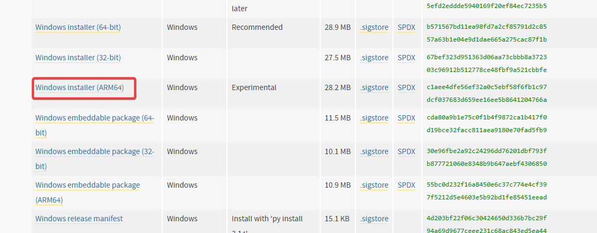
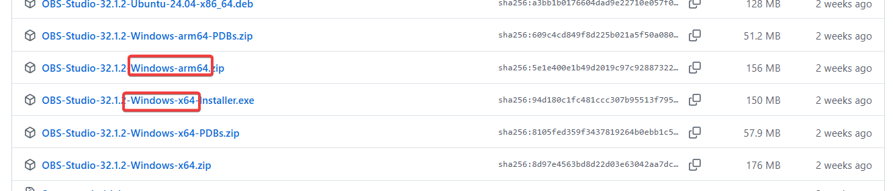

+++
date = '2026-05-08T10:37:34+08:00'
draft = false
title = 'x86、x64、AMD64、ARM 是什么？一文搞懂 CPU 架构，下载软件包不再迷糊'
tags = ['x86', 'x64', 'AMD64', 'ARM', 'CPU架构', '安装包下载', 'Intel', 'AMD']
description = '详细讲解 x86、x64、AMD64、ARM 分别是什么，Intel、AMD、苹果 Mac 芯片有什么关系，以及下载软件时应该如何选择正确的安装包。'
categories = ['IT杂谈']
+++

很多朋友不太了解 x86, x64, amd，arm……这些关键词。

今天，带大家完整的梳理一下这些名词是怎么回事。

## 1、intel和amd

计算机有一个核心的硬件 —— cpu。

它听不懂人类语言，只能“听”懂计算机的语言——指令集。

Intel公司在指令集的研发上先拔头筹，推出了“8086，80186，80286……”等处理器以及对应的指令集。

这些指令集统称为“x86”系列。

后来，Intel固步自封，没有进一步研发 x86 系列的 64位指令集。

而另外一家硬件厂商——AMD公司，后发制人，推出 "amd_x86_64"的指令集。

这个64位的 cpu 指令集，备受好评。就连 Intel 公司的处理器，都不得不采用 AMD 公司的方案。

因此，我们看到的 amd64 、 x86_64 、 x64 都是一个意思，都是 AMD 公司研发的 基于x86的 64位的 指令集。

## 2、arm

我们用到的电子设备，不仅有台式机，还有移动端设备。

例如，手机、智能手表、平板等等。

这些设备也有处理器。

处理器也需要指令集。

而移动端设备的指令集，用的是 arm 。

请注意，`arm 不是公司，是移动端（包括嵌入式）处理器的指令集的统称`。

采用这个指令集的处理器的优势是：能耗低、发热小、集成度高……

因此，这个指令集非常适配于移动端设备。

另外，一些轻薄笔记本，例如，macbook ， 它的处理器也采用了arm的指令集。

所以，当看到 arm 关键词的安装包时，就知道它是针对移动设备或者轻薄笔记本的安装包。

## 3、总结

相信大家在看完上面的描述之后，对 amd、arm、x86等名词会有更深刻的认识。

我们在下载软件的时候，逐一进行匹配即可。

先查看自己的设备信息——用的什么系统，处理器的指令集是什么。

再看软件列表的信息是什么，逐一对应就可以了。

---

以上就是本期分享，希望能跟您带来一些思考和帮助。也希望您能点赞关注支持一下，您的支持是本频道更新的最大动力。下期再见。

