+++
date = '2026-04-26T13:51:31+08:00'
draft = false
title = '如何从 GitHub 下载软件？Release、官网与 git clone 三种方法详解'
tags = ["github", "github教程", "下载软件", "git clone", "开源软件", "release"]
description = '手把手教你从 GitHub 下载软件的三种方法：Release 页面下载安装包、官网跳转下载、以及 ZIP 压缩包或 git clone 命令下载项目代码。附 Windows / macOS / Linux 及 x64、arm64 处理器架构文件名关键词对照表，新手也能看懂 GitHub Release。'
categories = ["git教程"]
+++

在之前的文章里，我们讲到了 github 宝藏软件的搜索技巧以及如何像刷抖音、逛淘宝一样玩 GitHub。

那么，有一个问题，就呼之欲出了 —— 我们找到这些宝藏软件之后，如何将它们下载下来呢？

今天通过实际案例，手把手教大家如何下载 github 上的软件。

## 1、release下载

release 下载方法是最简单，最主流的下载方法。

无论任何的项目，第一时间看一下，右侧侧边栏这里，是否有 release 这个入口。

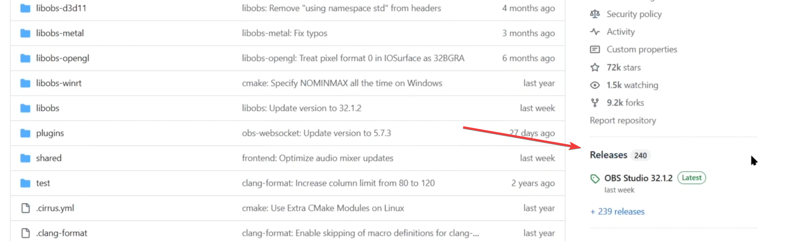

这里简单跟大家解释一下 release 是什么意思哈。

github项目是由原作者或者团队在维护。

大家不断地提交代码，不断地更新。忽然有一天，项目原作者认为 —— OK，当前版本足够稳定了，可以发布出来一个安装包，提供给用户使用了。

那么这个打包发出去的动作，就叫 release（发布）。

当我们进入 release 这个页面后，可以看到各种版本号，看着眼花缭乱的。其实，这是好事啊，这意味着，原作者或者团队在持续不断地更新这个项目。

另外，这里提示一下大家需要注意这么一个点 —— 这里有绿色的标识 latest 和橙色的标识 pre-release。

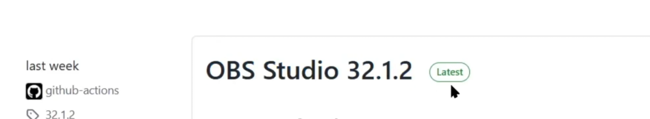

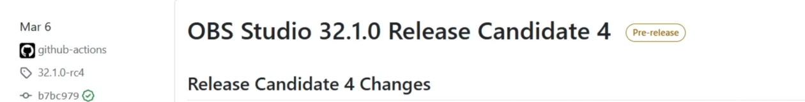

Latest vs Pre-release

- Latest（绿色标签）→ 最新、最稳定版，强力推荐大家下载这个标签下的内容
- Pre-release（黄色标签）→ 测试版，具备最新的功能，可能存在 bug。

OK，我们继续来看怎么下载。

以这个录屏工具 obs 为例。

在主页右侧这里，进入这个项目的 release 页面。

页面中，我们看到，不仅有刚才提到的版本号，还有当前这个版本具体的发布信息。例如，它添加了什么功能，移除了什么功能，修复了什么功能等等。

在这些信息中，最最重要的，就是 Assets 这个条目。

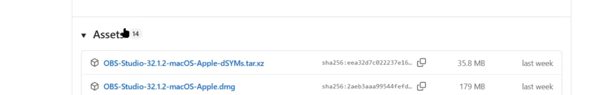

因为我们需要下载的安装包，都放在了这里。

有些人一看这么多东西，就蒙了哈。没关系，这里我教大家来看一下。

这个方法你学会之后，不仅可以用在GitHub社区，像python社区、nodejs社区，都可以按照这个规律去下载社区里的软件和三方库。

OK，那前面这里就是软件的名字，不用多说了吧。

后面的关键字就是操作系统。

你是苹果就找macos，你是windows就找windows关键字，这个也很简单。

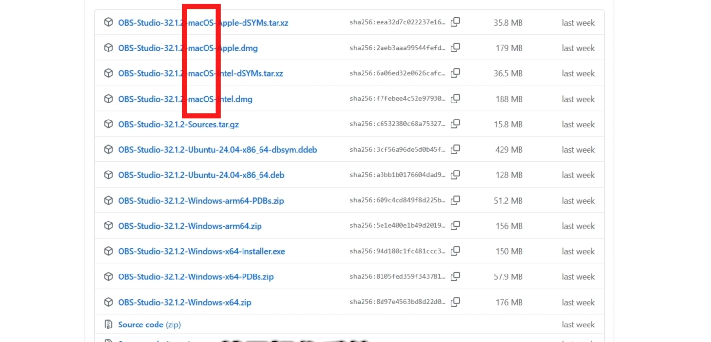

接下来，需要看这个处理器架构。

如果你的苹果机器用的intel处理器，你就找intel就可以了；如果你的苹果机器用自研的处理器，你就找apple就可以了。

如果你用的windows电脑，你可以鼠标右键点击开始，系统，打开之后，这里对比一下。

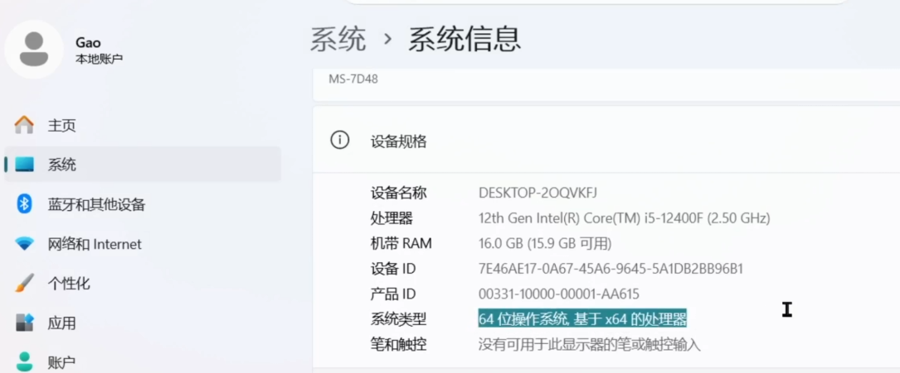

如果你这里显示的是基于x64处理器，那么你就找x64这里的软件包，进行下载。

如果你的 windows 电脑，这里显示的是 arm x64 架构，那么你就找arm64关键词的条目下载就可以了。

非常简单。说到这里，其实基本就可以筛选出来了。

最后，我们需要看一下这个后缀，苹果系统自然不必说，你找dmg就可以了。

如果，你用的是windows系统，你可以选择exe、msi、zip后缀的包，这些任选其一，进行下载，就可以了。

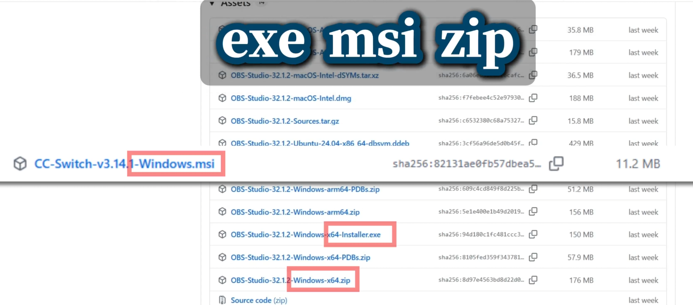

至于 pdb 这些奇奇怪怪的关键词信息，大家无视就可以了，这些跟我们的安装使用没有任何关系。

另外，需要说一点，如果你是新手的话，建议用exe、msi后缀软件包，进行安装，一路无脑点击下一步就可以了。

如果你对操作系统有一定研究的话，我强烈建议，你下载带有zip后缀的，或者这种portable,zip这种安装包。

因为这种方式叫做绿色安装，下完之后，你可以自行解压并配置好环境变量。如果不想用了，直接将文件夹删除就可以了。不会给系统带来额外的垃圾，非常的清爽。

我把关键词都整合在这里了，大家有需要的话，可以参考一下。

| 关键词 | 含义 |
|--------|------|
| `windows` / `win` / `.exe` / `.msi` | Windows |
| `macos` / `darwin` / `.dmg` / `.pkg` | macOS |
| `linux` / `.deb` / `.rpm` / `.AppImage` | Linux |
| `x64` / `amd64` / `x86_64` | 64位 Intel/AMD 处理器 |
| `arm64` / `aarch64` | ARM 处理器（移动端处理器/树莓派等） |
| `x86` / `i686` / `32bit` | 32位（老电脑） |

## 2、项目官网下载

项目官网下载这个方式，说实话，比较邪修。

因为，网站的维护需要成本嘛。一般的小团队、小项目，都不会配置官网页面。

可能十个项目里面，有一两个会有官网页面。

这也算是一种方法。所以，在这里我也分享给大家。

我们打开项目之后呢，依然是看一下侧边栏这里。

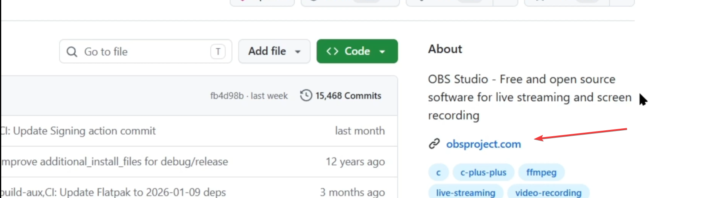

在 About 栏目下，如果看到了这样的链接，点击进去。一般来讲，这里列出的，就是这个项目的官网链接。

接下来，我们可以在官网里，找到对应的下载渠道，进行安装包的下载。

## 3、仓库下载

很多朋友可能会有这样的问题哈。

就是，拿到这个项目之后，我只想看看这个项目的代码，或者说这个项目它本身就是一些文档。

release 那里，没有提供下载链接，这怎么办呢？

这里跟大家分享四种方法，教怎么把这个项目里的内容下载下来。

第一个方法是单个文件下载。

我们以这个python学习笔记的项目为例。

点击进来之后，我们可以看到这里有原作者上传的并开源的学习笔记。

比方说，我们想下载这个pdf文件，我们直接点击进去就可以了。

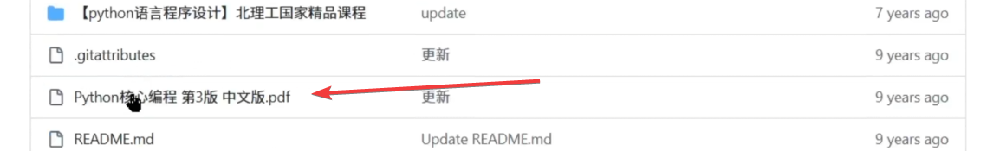

然后，在右上角这里找到一个下载的icon。点击一下，就可以将它下载了。

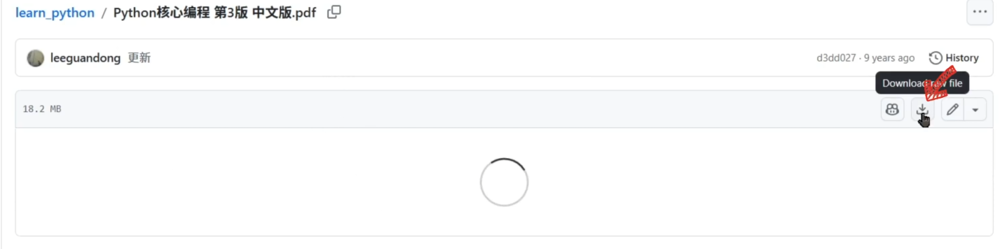

怎么样？是不是特别简单。

第2个方法是download zip下载法。

我们在这个项目主页中，直接点击这里的 download zip 按钮，进行下载就可以了。

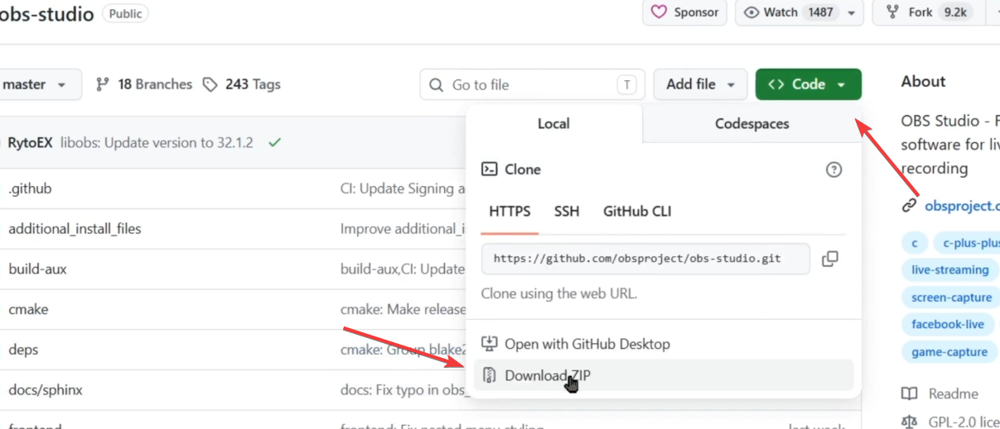

下载完成之后，我们解压这个压缩包，然后，使用编辑工具例如 vscode 或者 cursor。

就可以把这个项目打开了。然后，就可以愉快地浏览了。

第3个方法，是 https 指令下载法。

我们找到一个合适的文件夹，在路径那里输入cmd，打开指令弹窗。

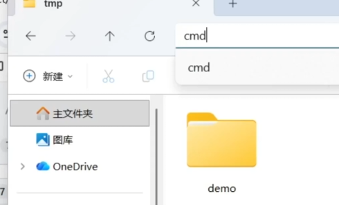

弹窗所在的路径，跟文件夹的路径是完全一致的。

接下来,我们点击这里https这个选项，点击拷贝按钮。然后，回到命令行这里，输入 git clone + 拷贝内容。

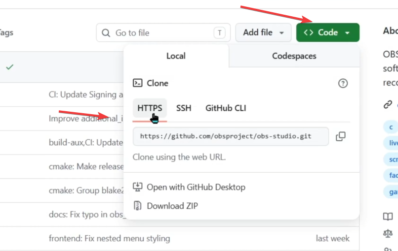

点击回车，就可以将它下载下来了。

`请注意：这个方式可能会出现一个弹窗，让你输入gihub的账户名和密码，略微有点麻烦。我这里因为之前已经输入过了，所以，这次演示的时候，没有让我输入密码。`

第4个方法，是 ssh 指令下载法。

我们依然按照刚才的指令打开cmd窗口。

接下来，我们点击ssh这个选项，点击拷贝按钮。然后，回到命令行这里，输入 git clone + 拷贝内容。

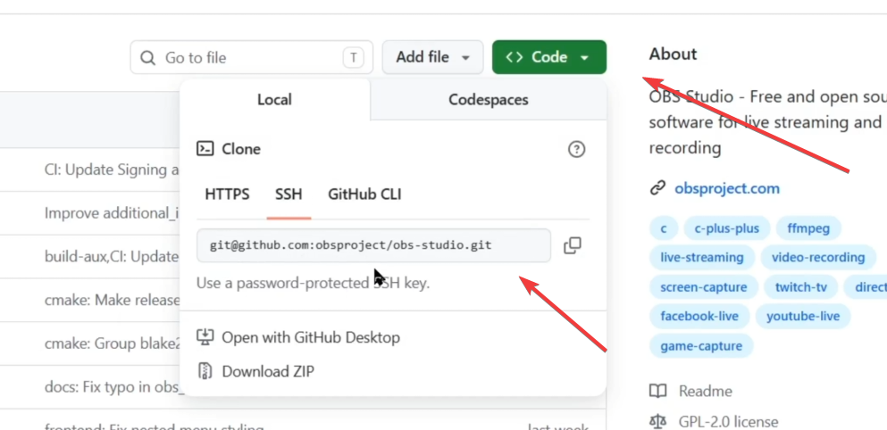

点击回车，就可以将它下载下来了。

---

以上就是本期分享，感谢大家的观看。您的点赞关注，是本频道更新的最大动力。希望这些分享能给您带来一些帮助和思考。

