+++
date = '2026-05-04T09:57:07+08:00'
draft = false
title = '开源协议怎么选？MIT、BSD、Apache 2.0、GPL、AGPL、LGPL、MPL 完全指南'
tags = ['GitHub', '开源协议', 'MIT', 'BSD', 'Apache 2.0', 'GPL', 'AGPL', 'LGPL', 'MPL', '开源', 'License', '软件许可证', '版权声明', '开源项目']
description = '不懂开源协议可能面临法律风险！本文详解 7 种常见开源协议（MIT/BSD/Apache 2.0/GPL/AGPL/LGPL/MPL）的核心区别、适用场景与选用建议，并手把手教你在 GitHub 添加协议，以及用 pip-licenses 一键检查依赖协议。'
categories = ['git教程']
+++

有些朋友可能会认为——开源不就免费随便用吗。

nonono，这个认知是大错特错的。

搞不清楚开源协议，可能会吃官司哦。

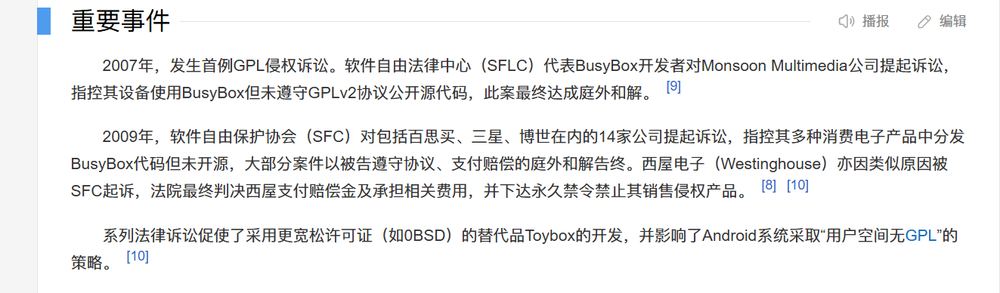


本篇文章会按照从尺度宽松到严格的顺序，带大家盘点不同的开源协议。

并且会结合实战案例，教大家如何一键添加开源协议。

---

先来介绍，开源协议中的佛系三剑客 —— MIT、BSD、Apache。

为啥叫它们佛系三剑客呢？因为，它们的要求很宽松，IT界统称它们为“宽松型开源协议”。

这三剑客的共同点 —— 可以自由地商业化、修改代码、甚至把修改的版本闭源。

总而言之，看到这些协议的开源项目，你用就完事了，不要有任何负担。

那它们有什么不同点呢？

## 1、MIT

MIT 协议有一个要求 —— 在你分发软件的时候，要把版权声明带上。

第一个问题——什么是软件分发呢？

软件分发是把你的软件，打包给别人使用。

你自己做个网站，别人来访问，这不叫分发。但是，你把网站代码打包发给别人，这就叫分发了。

所以，这个时候就需要声明一下 —— 你项目中，用了哪些开源项目。

第二个问题——怎么声明？

如果你是在代码中，直接引用了别人的代码，那么，你需要添加这样的声明。

```
--- 引用部分开始 ---
Copyright (c) 2022 原作者名字
Licensed under the MIT License (MIT)
--- 引用部分结束 ---

这里开始写你自己的代码...
```

如果采用调用三方库的形式，那么你需要在项目中添加`THIRD-PARTY-NOTICES.txt`这样的声明。

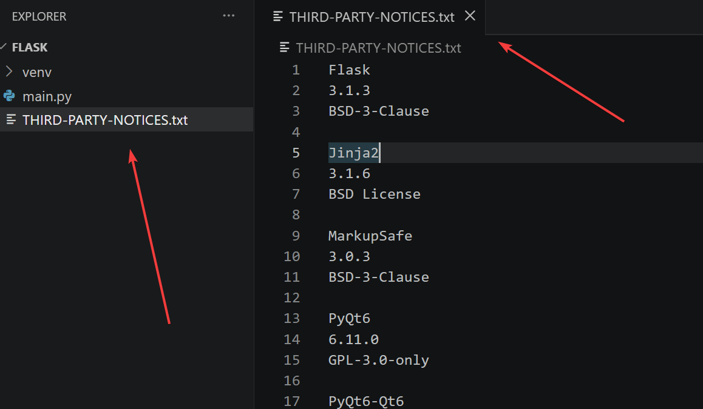

这些文件看似复杂，其实都可以一键生成。

后面的实战案例中，我会跟大家分享。

前端大名鼎鼎的vue框架、jquery框架，使用的就是MIT协议。

## 2、BSD

BSD 协议，增加了一条 —— 不能用原作者的名义或商标来给你的衍生产品做商业推广。

比方说，你的团队开源了一个项目，它遵从 bsd 开源协议。

我的产品用了你的项目。

我在做产品宣传的时候，不能大张旗鼓地说：我的产品用了某某大佬团队的技术，保证这个产品又丝滑又稳定又安全。


## 3、Apache License 2.0

apache协议在专利层面上，对开源的项目进行约束，以防止一些专利流氓破坏开源环境。

举个例子：A公司申请了某个专利技术，叫小a专利。

某个开源项目 xx 的负责人C，使用了这个小a专利。

A公司见有利可图，便起诉了负责人C要求赔偿。起诉的同时，A公司就不能继续使用 xx 项目了。

虽然，负责人 C 无偿使用了A公司的技术，但A公司不能既使用别人的开源项目，又背刺别人……

正因有了专利方面的约束，所以，企业级、大型团队做项目的时候，都倾向于 apache 协议。大名鼎鼎的 tensorflow，kafka 项目都用的 apache 协议。

需要注意 —— 如果对apache协议的项目进行了修改，你需要标注一下修改了哪些内容。

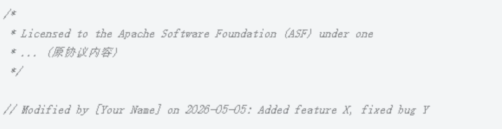

如果原项目包含了 NOTICE 文件，那么你修改的项目中也应该包含 NOTICE 文件，并且追加一下你做的那部分调整。

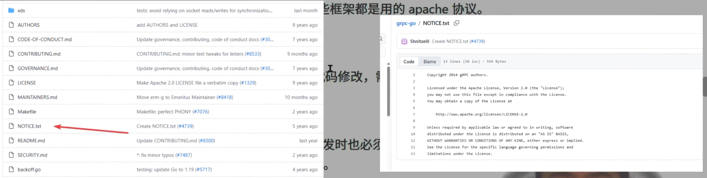

这里将 Apache 2.0、MIT、BSD 核心区别整理如下：

### 常用宽松型开源协议对比表

| 特性 | MIT | BSD | Apache 2.0 |  
|---|---|---|---|
| 协议风格 | 极简、流行 | 严谨、学术 | 工业级、商业友好 |
| 允许商用/闭源 | ✅ 是 | ✅ 是 | ✅ 是 |
| 保留版权声明 | ✅ 必须保留 | ✅ 必须保留 | ✅ 必须保留 |
| 修改后需标注 | ❌ 不需要 | ❌ 不需要 | ✅ 必须标注 |
| 明确专利授权 | ❌ 未提及 | ❌ 未提及 | ✅ 包含专利授权 |
| 禁止名誉背书 | ❌ 未提及 | ✅ 明确禁止 | ✅ 明确禁止 |
| 主要区别点 | 只要保留原作者名字，怎么用都行。 | 额外规定不能用原作者的名号给产品打广告。 | 最安全。保护专利，且修改过的代码文件必须说明改了哪里。 |

### 宽松型协议选用建议

   1. 选 MIT，最省事。它是目前开发者最常用的协议，文档极短，能让你的代码得到最广泛的传播。
   2. 如果是商业项目/公司产品，强烈建议选 Apache 2.0。它提供的专利授权条款能保护你和你的用户免受专利流氓的骚扰。
   3. 如果你担心名声受损，就选 BSD。它可以防止别人在宣传低质量产品的时候，说“这是基于某某牛人的项目开发的”。

---

刚才说的是宽松派，接下来介绍一下另外一个派别——传染派。

为什么叫传染派呢？

如果你的项目，用了这个协议下的开源工具，那么，你的项目也必须开源。

## 4、GPL，AGPL

这两个协议，属于强传染型开源协议，其核心思想 —— 你用了我的代码，你的整个项目也必须用同样的协议。

请注意：开源不代表不能商业化。

即便使用 GPL、AGPL 协议的项目，依然可以拿来卖钱。

但是，假如客户需要源码，项目负责人必须给他源码。

有些朋友可能会说，代码都给别人了，技术壁垒完全被打破，这不就赚不到钱了？！

对，这个观点完全没错，所以，很多开发者或团队，选择卖服务而不是卖软件 —— 软件我可以免费给你，但安装、调试、后期维护，我会选择收费。

再来聊一下 GPL 和 AGPL 的区别。

GPL规定 —— 只有当你的软件分发给别人的时候，才需要开源。假设，你在自己的服务器上跑一个网站，你的网站不需要开源。

大名鼎鼎的 linux/kernel, wordpress, blender 均采用GPL开源协议。

而同样的场景下，AGPL 不同，即便用户是通过网络访问了你的网站，你的网站仍然要开源。

监控指标展示平台 grafana 用的就是 AGPL 开源协议。

## 5、LGPL，MPL

这两个协议不会强制要求开源。

LGPL协议规定：

如果你的项目是静态编译的，那就必须开源，因为静态编译相当于把别人的代码糅合到了你的项目中；

如果是动态编译，或者像 python 那样调用三方库，那么就不需要强制开源，因为它只是调用，大家的项目都是分离的。

FFmpeg、glibc 均采用lgpl协议。

MPL 协议则不同。它的逻辑是：以“文件”为边界。

假设，你的项目里有 100 个文件，其中 1 个文件引用了 MPL 协议的代码，另外 99 个是你原创的。

那么，你只需要把那 1 个文件开源，剩下的 99 个文件可以完全闭源。

开源办公软件库 LibreOffice 用的是MPL开源协议。

### 传染型协议简单汇总

| 许可证 | 全称 | 总结 |
|--------|------|--------|
| **GPL v3** | GNU General Public License v3 | 用了就必须全部开源，分发时触发 |
| **AGPL v3** | GNU Affero GPL v3 | 比 GPL 更严，网络服务也触发 |
| **LGPL v3** | GNU Lesser GPL v3 | 只限制库本身，调用方可以闭源 |
| **MPL 2.0** | Mozilla Public License 2.0 | 只限制修改过的文件，其余可闭源 |

### 传染型协议使用建议

```
你要发布一个开源项目
│
├─ 是库 / SDK，希望商业应用也能用？
│   ├─ 只要求库本身改动回流 → LGPL v3
│   └─ 更宽松，只要求文件级别 → MPL 2.0
│
└─ 是完整应用，不希望被商业闭源？
    ├─ 主要是桌面/客户端软件 → GPL v3
    └─ 主要是 SaaS / 网络服务 → AGPL v3
```

## 6、特殊情况

最后，跟大家聊一个特殊情况 —— 项目没有显示任何协议，这种要怎么办呢？

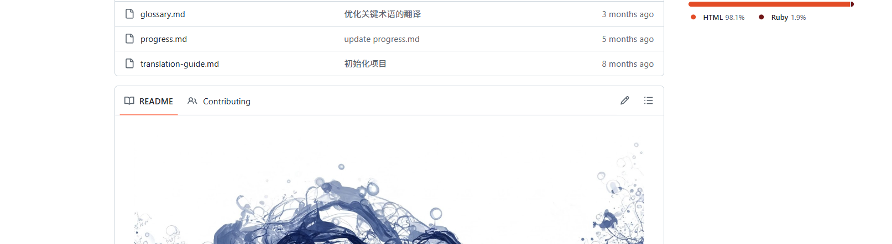

这种情况属于默认版权保护方式。

假如你碰到了这样的项目 —— 你可以阅读源码、学习它的设计理念、克隆到本地自己使用。但是，千万不能修改、分发、或者用作其它商业用途。这属于侵权行为。


## 7、开源协议的添加

最后跟大家分享一下如何添加开源协议。


找到你的项目主页，点击addfile，然后，点击create file。

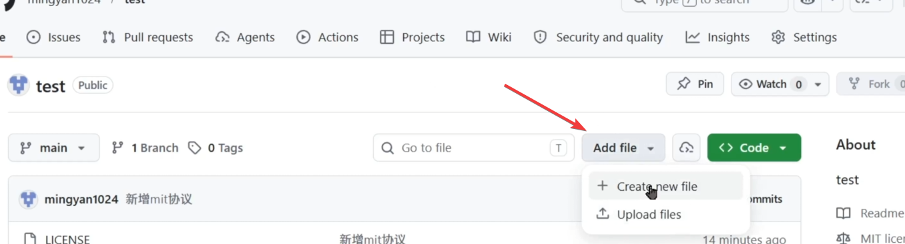

在输入框这里，输入`LICENSE`。

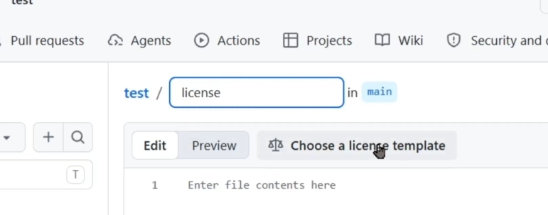

这里就会出现一个选项，点击它，跳转到模板页面，选择一个合适的协议，然后，提交。

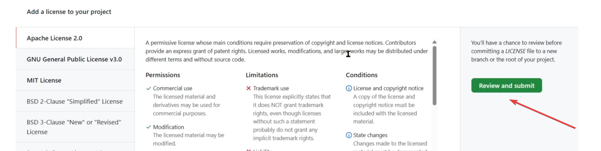

提交之后，我们可以看到这个许可证已经生成了。

还没完，你需要点击右上角的 commit changes。在这里，填写备注信息。

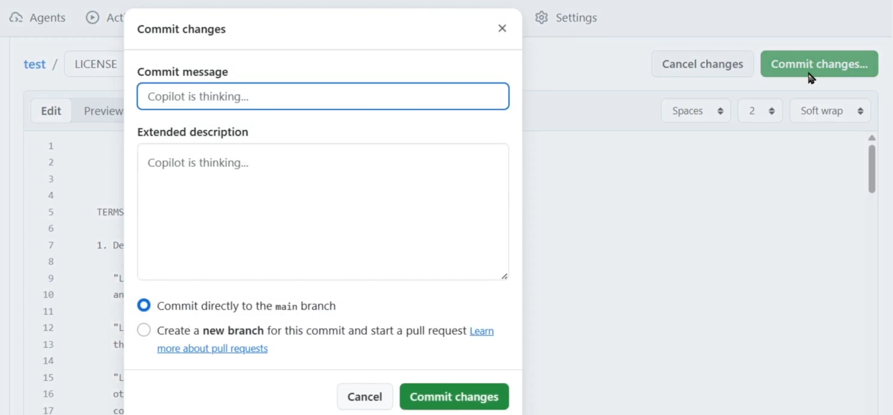

点击commit changes 按钮，协议添加成功！

如果，你想要补充一些具体的信息，那么你需要点击 edit file ，把年份、负责人信息，填充到许可证里。

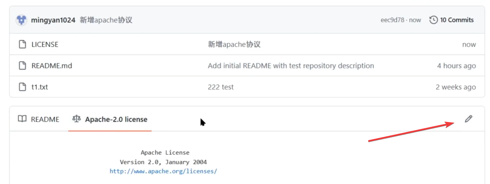

接下来，跟刚才一样，点击commit changes, 填写备注，你的 edit 就生效了。

最后的最后，还有一个问题 —— 我搞出来了一个项目，这个项目引用了很多开源工具。

但是，我不知道它们用了什么协议。假如说，它们用了很严格的协议，那我的项目就要跟它保持一致。

这怎么办？难道我要一个逐一检查一下它们的协议内容吗？

nono，不需要。

这里以这个 python 项目为例，介绍一个工具 —— `pip-licenses`。

我们通过 `pip install pip-licenses` 指令下载这个工具。

下载好了之后，输入`pip-licenses --summary`, 就能汇总出来你项目的所有开源协议。

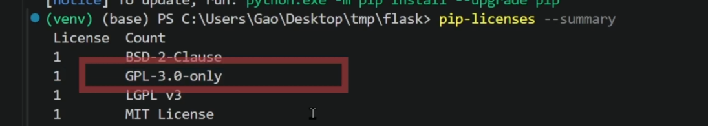

如果你需要生成一个第三方版权声明，那么你可以输入` pip-licenses --format=plain-vertical > THIRD-PARTY-NOTICES.txt` 这个指令。瞬间就能汇总好一份三方库的版权声明。

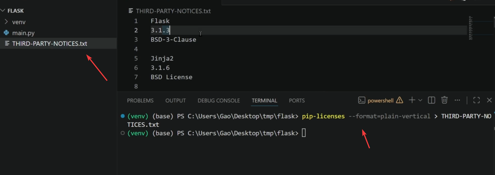

---

ok，以上就是本期分享，希望能给您带来思考和帮助。另外，也希望大家点赞关注支持一下，您的支持是本频道更新的最大动力。
