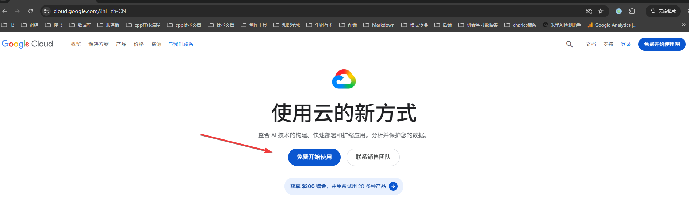
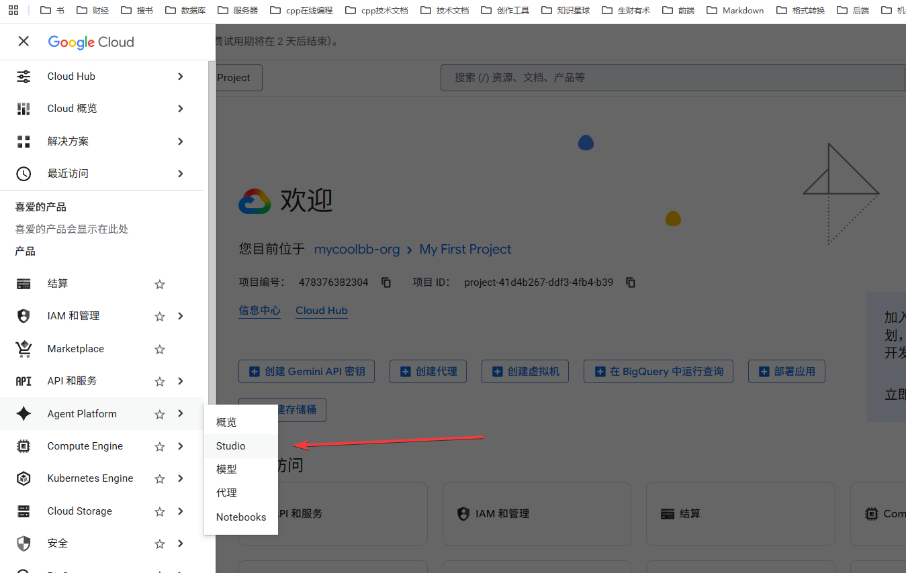
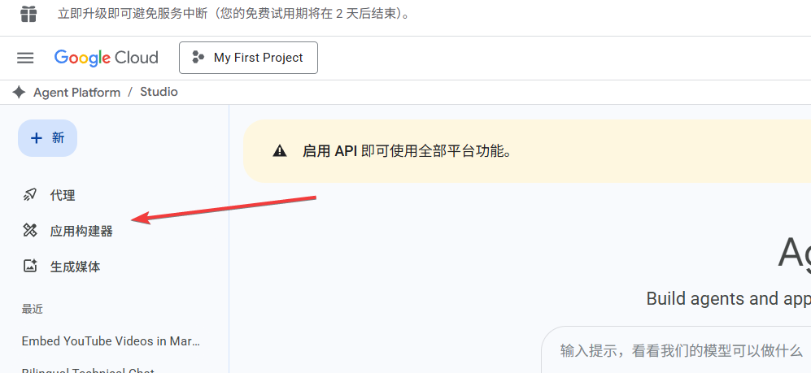

+++
date = '2026-05-22T11:39:13+08:00'
draft = false
title = '谷歌云 App Builder 完全指南：免费 Vibe Coding 一键生成并上线应用'
tags = ["谷歌云", "Google Cloud", "App Builder", "Vibe Coding", "AI编程", "应用部署", "Cloud Run", "Gemini", "免费建站", "自定义域名"]
description = '谷歌云应用构建器（App Builder）是真正的 Vibe Coding 天花板——AI 写代码、自动部署上线，一键搞定。本文详细介绍如何用 Google App Builder 免费构建并发布应用，涵盖 Cloud Run 部署、自定义域名绑定、API Key 配置等完整流程，零成本拥有属于自己的 AI 应用。'
categories = ["AI相关"]
+++

谷歌云平台有个应用构建器的功能，这个工具真的是太强大了。

简直是 vibe coding 的天花板。

## 1、谷歌云注册

首先打开谷歌云官网，我们可以看到这里个提示。

每个新注册的谷歌云账号，都可以获得300美元赠金。

接下来点击登录，用谷歌的gmail邮箱，注册谷歌云。

注册成功之后，你就可以使用谷歌云的300美元赠金。

因为我的邮箱已经申请过了，所以，没办法演示了。

建议大家搜索一下“谷歌云注册”关键字，你可以搜到一大把相关的文章或视频。

## 2、应用构建器界面

打开谷歌云官网，找到 agent platform/studio/应用构建器，进入到应用构建器的页面。

下面的输入框，是跟ai对话的入口。

## 3、vibe coding 应用

*（请查看视频演示：[视频链接](https://youtu.be/cQ6NqmUmI2I?si=g8phN_ZhUQEHo8Zn)）*

我在输入框里输入我的需求，让它帮我生成一个童话故事生成器。

稍等片刻，它就搞定了。

你可以在点击预览，在这里体验一下这个应用。

右上角这里是保存按钮，点击之后，你跟ai的对话就会保存，否则，关闭页面之后，这段对话就消失了。

代码这里就是ai帮你实现的代码，你可以看到项目的源代码。

右侧这里有个下载入口，点击之后，可以将整个项目的源代码下载下来。

## 4、应用部署

*（请查看视频演示：[视频链接](https://youtu.be/cQ6NqmUmI2I?si=g8phN_ZhUQEHo8Zn)）*

点击小火箭就可以部署。

为了方便所有人都可以访问，我们这里的权限都选择公开。

点击这里的open，就可以打开应用，或者，在小火箭这里打开应用也可以。

如果，你希望其他人品尝一下你的劳动成果，你可以把链接丢给其他人访问。

另外，这个链接在手机端也可以打开。

假如，我用的时候，有bug了怎么办？

这个问题很好解决，你把问题告诉ai让它帮你解决。

之后，你点击小火箭这里的管理应用，然后点击更新应用就可以了。

## 5、绑定域名

*（请查看视频演示：[视频链接](https://youtu.be/cQ6NqmUmI2I?si=g8phN_ZhUQEHo8Zn)）*

绑定域名首先你要有一个域名，大家可以在 Cloudflare、NameSilo、GoDaddy、阿里云、腾讯云等平台购买一个域名。

假如说，你已经拥有域名了。

你在谷歌云的导航栏这里，点击Cloud Run，接下来找这个网域映射。然后，添加映射。

请注意，这里应用的ID一定要跟你想要绑定域名的那个应用的ID，保持一致。

接下来，把域名丢进去，然后，给这个域名，添加一个子域名的字段。

接下来我们打开域名平台，我这里用的是CloudFlare。

我们选择domain，选择绑定的那个域名，选择dns，records，然后，点击右上角的 add record。

接下来，我们参照谷歌云给的提示，type、name、target 均保持一致。

其它选项保持默认即可。

点击save。

回到谷歌云，点击完成。

稍等片刻，这个域名就绑定成功了。

## 6、新的风暴

*（请查看视频演示：[视频链接](https://youtu.be/cQ6NqmUmI2I?si=g8phN_ZhUQEHo8Zn)）*

你通过绑定的域名，直接使用这个应用的时候，就会出现error。

究其原因，是因为你的应用是部署在谷歌云平台上面。

谷歌云平台又会调用 gemini 模型。

因此，我们想要使用带有ai功能的应用时，必须要在 url 中携带 key 才能使用成功。

回到我们的应用构建器页面。

我们可以看到，key就放在小火箭的管理应用这里。

将它复制下来，在域名后面 按照 斜杠、问号、key、等号的顺序，拼接在一起。

使用这个完整的链接，就不会出现刚才的报错了。

---

感谢阅读！
