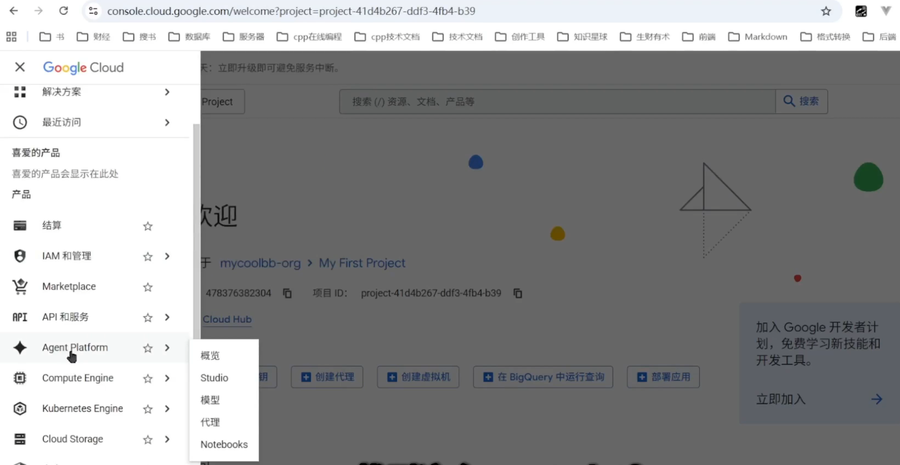
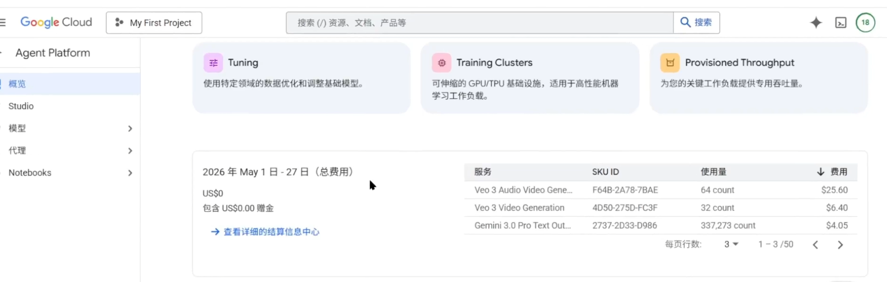
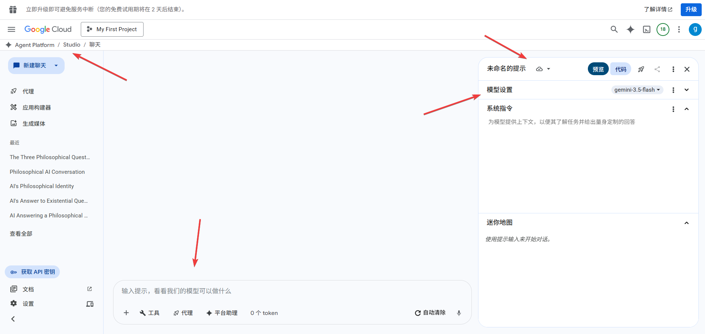
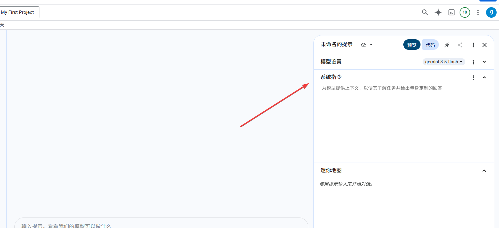
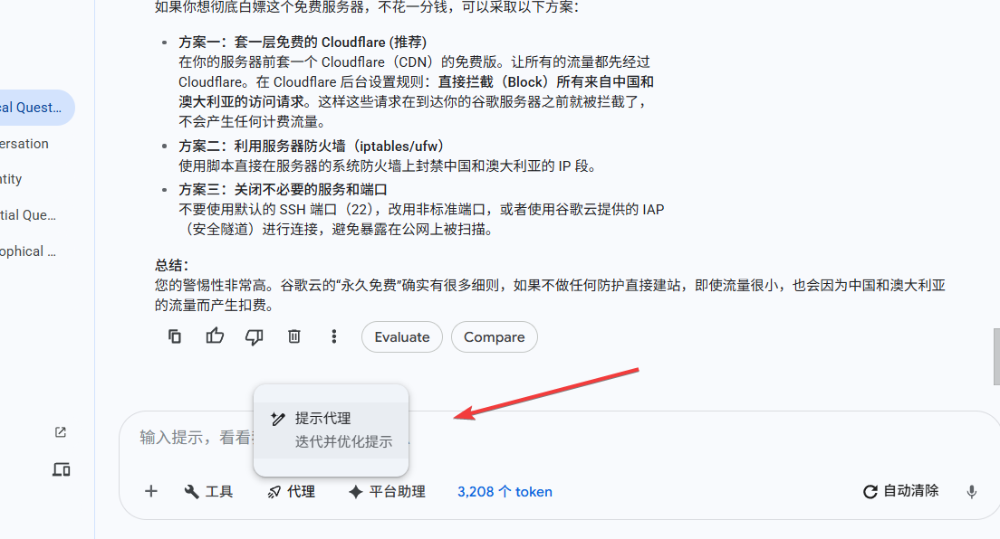
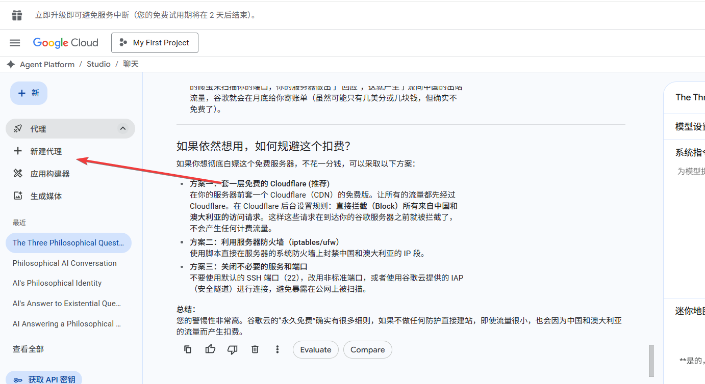
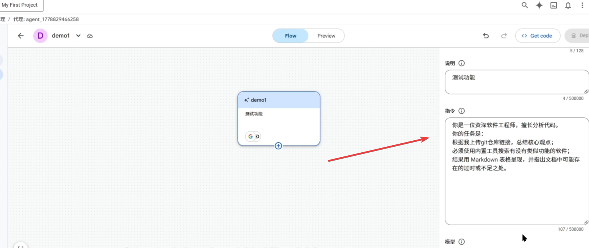
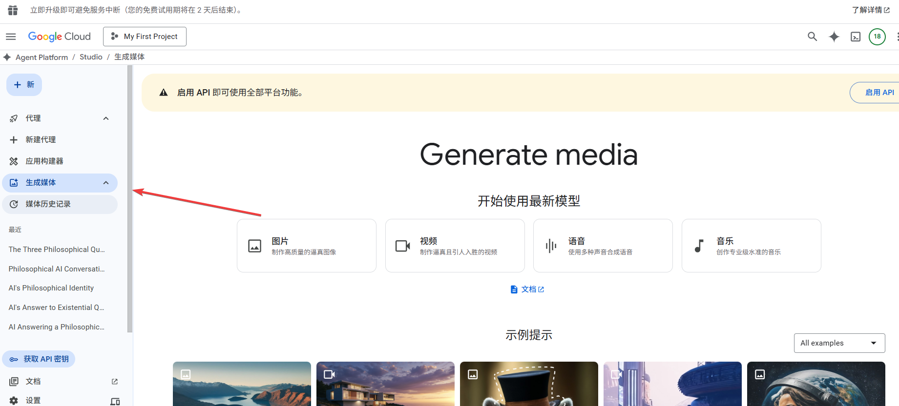
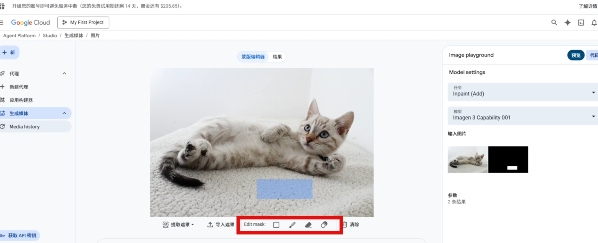

+++
date = '2026-05-14T21:45:45+08:00'
draft = false
title = '白嫖谷歌云300美元：用 Agent Platform 搭建你的专属 AI 应用'
tags = ["Google Cloud", "谷歌云", "AI应用", "Agent Platform", "Gemini", "免费赠金", "AI开发", "云平台"]
description = '手把手教你用谷歌云300美元赠金，在 Agent Platform 上搭建 AI 应用。涵盖赠金获取、AI Studio 使用、Agent 构建、GitHub仓库分析等实战案例，让300美元物尽其用。'
categories = ["ai相关"]
+++

今天的文章，分享如何使用谷歌云的 agent platform 平台。


## 1、谷歌云 ai 平台概览

点击导航，点击左侧侧边栏，点击agent platform。这个页面就是谷歌云ai平台的概览页面。



概览这里面介绍了，ai平台用了哪些模型，集成了哪些功能。

最下面是费用统计。这里展示了，我们在ai平台的费用情况——调用了哪些模型，消耗了多少token，花了多少钱。



## 2、谷歌云 ai 平台问答


输入框可以进行文字，右侧可以切换模型。

右上角这里是一个保存按钮，点击之后，可以将这段对话保存下来。也可以启用自动保存功能。

请注意：一定要及时保存你跟ai的对话，否则的话，关闭网页之后，它就消失了。




右侧这里是，系统指令。作用是给 AI 立规矩，你能做什么，你不能做什么。



例如：

```
你是一个JSON格式转换器。

无论我输入什么，你只能返回合法的JSON代码块，严禁包含“好的”、“没问题”等解释性文字。
```

指令生效之后，ai响应的格式已经是json格式了。

右下角这里的迷你地图显示——问答记录。

我们也可以调用 apikey ，通过代码进行问答。

要点：

- 将你的服务器与谷歌云进行认证

- pip指令下载谷歌ai的sdk

```
pip install --upgrade google-genai
```

- 将代码拷贝到你的服务器上

```
import os

os.environ["GOOGLE_CLOUD_PROJECT"] = "project-41d4b267-ddf3-4fb4-b39"
os.environ["GOOGLE_CLOUD_LOCATION"] = "global"
os.environ["GOOGLE_GENAI_USE_VERTEXAI"] = "True"

from google import genai
from google.genai.types import HttpOptions

client = genai.Client(http_options=HttpOptions(api_version="v1"))
response = client.models.generate_content(
    model="gemini-2.5-flash",
    contents="你是谁？从哪来？到哪去？",
)
print(response.text)
```

*具体实践请参考，我分享的视频*


## 3、谷歌云 ai agent

提示代理的作用——帮你优化提示词。



比方说，有这么一个需求——“我是微信公众号博主，我希望写出来的文案ai味少一些，请给我提示词”。


我们也可以自行配置代理，点击这里的新建代理。




我们选中这节点，给这个节点起一个名字，并附上备注说明。



指令这个输入框里，我写了这样一段提示词，让它帮我分析github仓库：

```
你是一位资深软件工程师，擅长分析代码。

你的任务是：

根据我上传git仓库链接，总结核心观点；

必须使用内置工具搜索有没有类似功能的软件；

结果用 Markdown 表格呈现，并指出文档中可能存在的过时或不足之处。

```

点击preview，体验一下这个agent。

## 4、谷歌云ai 应用构建器

这个功能非常强大，我单独出了一篇文章和一篇视频进行讲解。

请参阅这篇文章：[谷歌云 App Builder 完全指南：免费 Vibe Coding 一键构建并上线应用](https://gaomian.org/posts/google-app-builder/)

请浏览这个视频：[谷歌云 vibe coding 天花板](https://youtu.be/cQ6NqmUmI2I?si=y8qtGjsRHHA7XpaW)

## 5、谷歌云ai 生成媒体

这个页面的功能，是根据提示词，生成图片、视频、音乐……



我们可以借助ai，对图片进行ps：

1、上传一张自己的图片。

2、使用遮罩层，在小猫面前划定一个区域，然后，告诉ai，在此处添加小鱼干。



3、可以看到 ai 会按照我们的需求，对图片进行调整。

---

感谢阅读！

