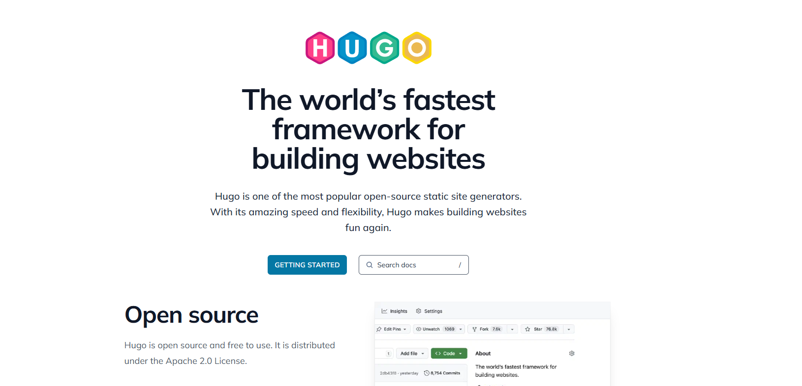
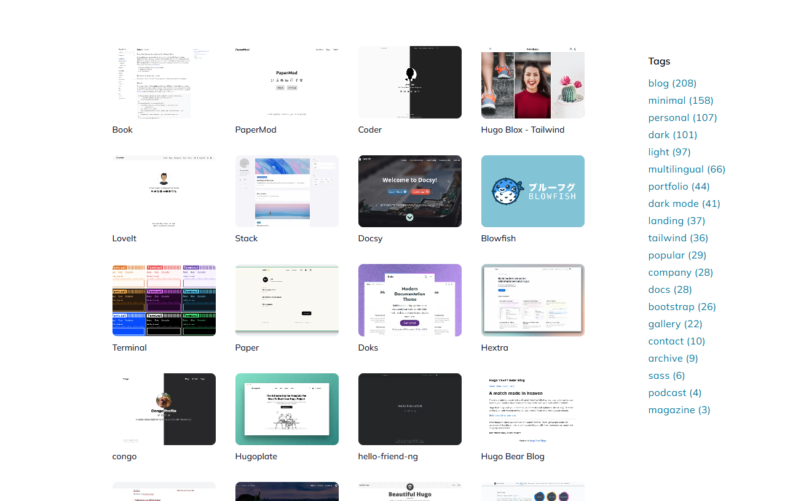
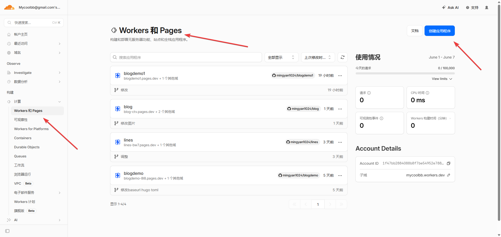
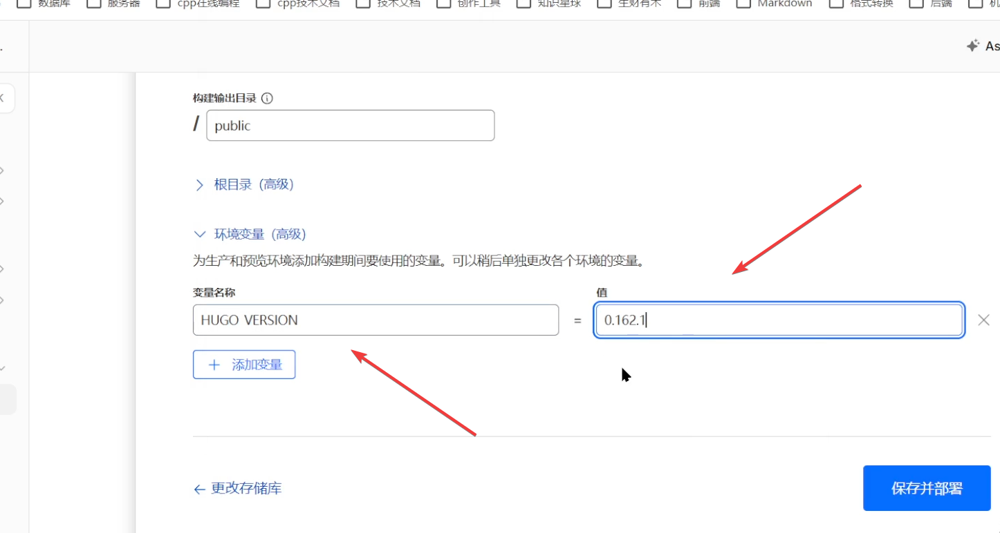
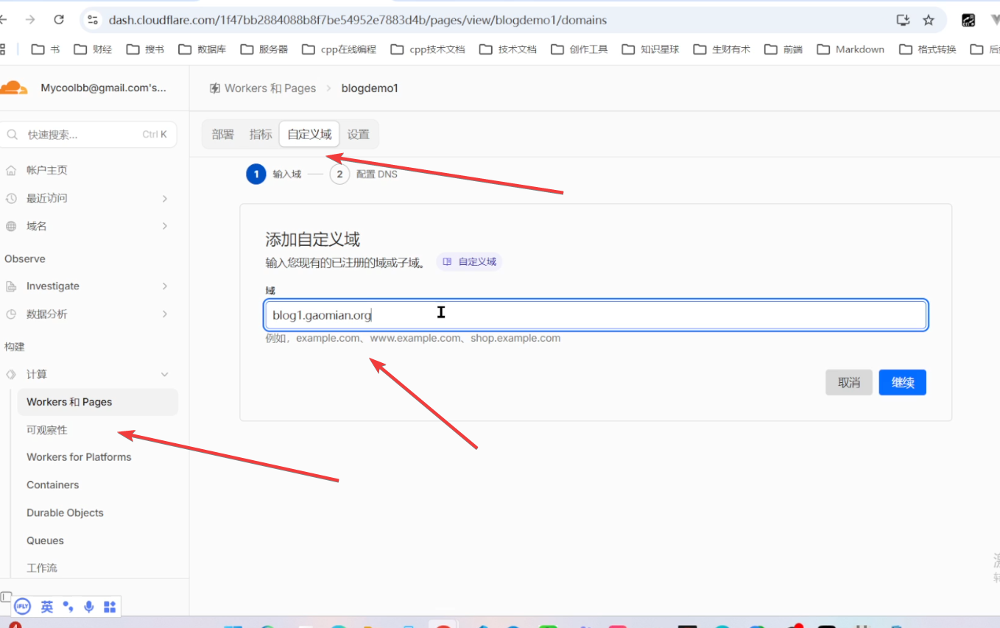

+++
date = '2026-05-30T09:20:05+08:00'
draft = false
title = '零成本搭建个人博客：Hugo + GitHub + Cloudflare Pages 全流程教程'
tags = ["Hugo", "博客搭建", "GitHub", "Cloudflare Pages", "免费建站", "静态网站", "个人博客"]
description = '手把手教你用 Hugo 静态框架，配合 GitHub 和 Cloudflare Pages，完全免费地搭建并部署个人博客网站，无需购买服务器，支持自定义域名，内容更新自动同步。'
categories = ["web建站"]
+++

今天跟大家分享一下，如何不花钱，不用购买服务器，将博客部署上线。

## 1、博客工具

做博客有很多工具，这里我推荐hugo。

理由如下：

1、安装简单，不需要搭建复杂的环境。

2、使用简单，你不需要敲代码，直接写博客内容、粘贴图片就可以发布博客了。

3、主题丰富，你不需要自己设计网页，直接套用别人的主题就可以了。如果你想diy，也可以在别人的主题的基础上修改即可，这些资源都是开源免费的。

hugo的具体使用方法，需要单独开文章分享，这里就不赘述了，否则篇幅过长。

## 2、推到git平台

假设大家已经，使用 hugo 构建了 这样的一个博客。

我们先使用 git init 指令，在本地创建仓库。

接下来，在github平台，创建一个远程仓库。

接下来，使用 git add、git commit、git push 等指令,将博客内容推送上去。

（建议对照视频：01:20 开始 ）

## 3、免费部署上线

我们使用 CloudFlare Page功能，免费部署上线。

这里需要新增环境变量的配置 HUGO_VERSION = xxxx。

确保构建平台的hugo版本和我们电脑本地的hugo版本保持一致。

（建议对照视频：03:38 开始 ）

## 4、配置域名

配置域名，首先要购买域名。

购买域名的步骤，我已经梳理清楚了，大家可以看一下这个视频。

假如说，你此刻已经购买了一个域名。

那么你可以在自定义域这里，添加一个合适的域名

配置生效之后，你的博客网站就发布成功了。

（建议对照视频：07:32 开始 ）

---

以上就是本期分享，希望您能点赞关注支持一下，您的支持是本频道更新的最大动力。

