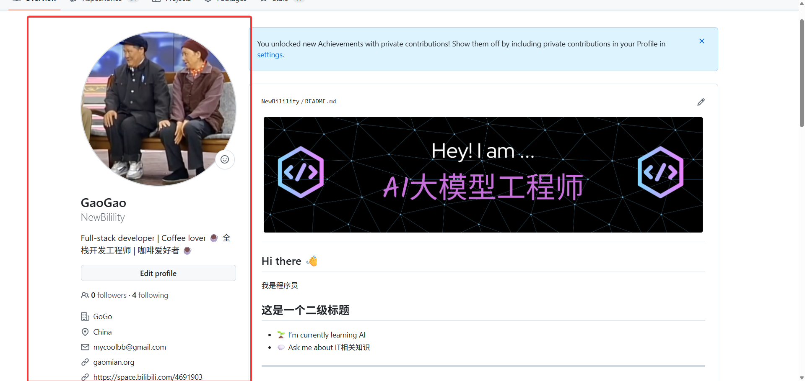
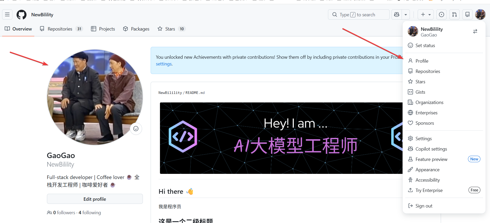
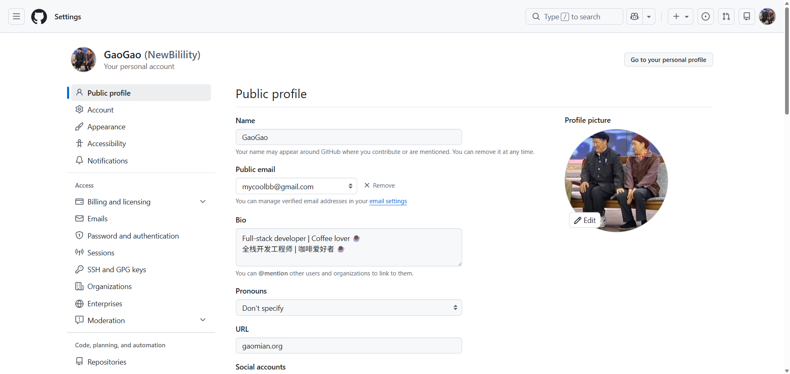
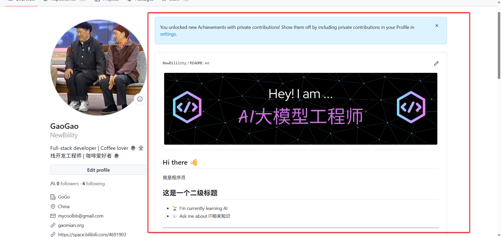
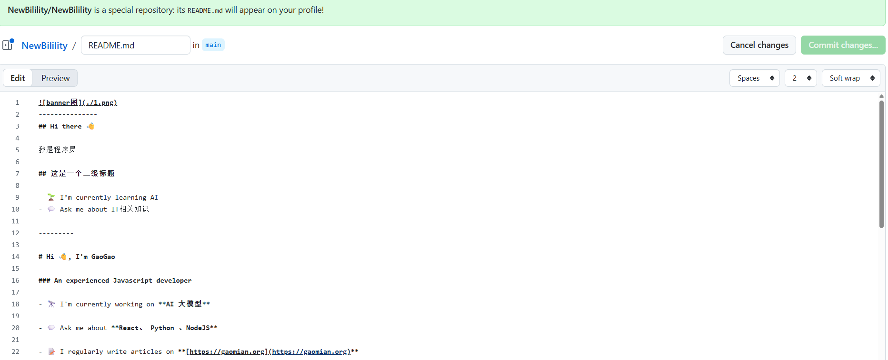
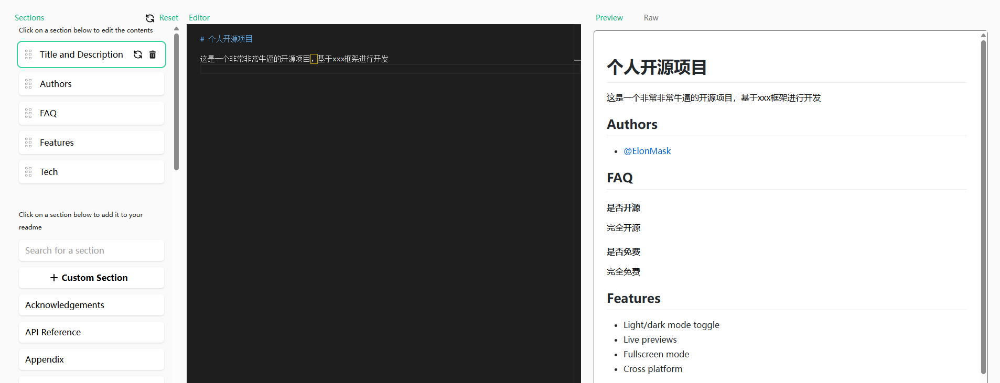
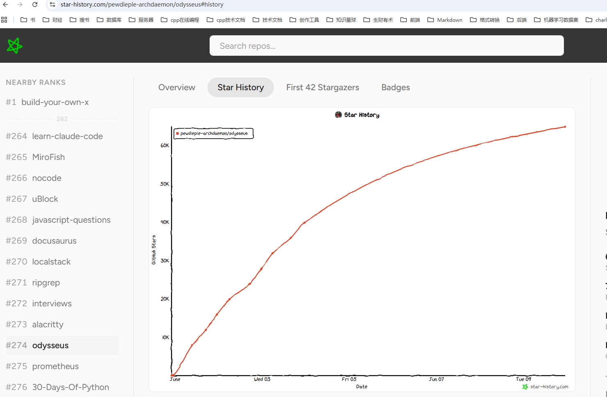
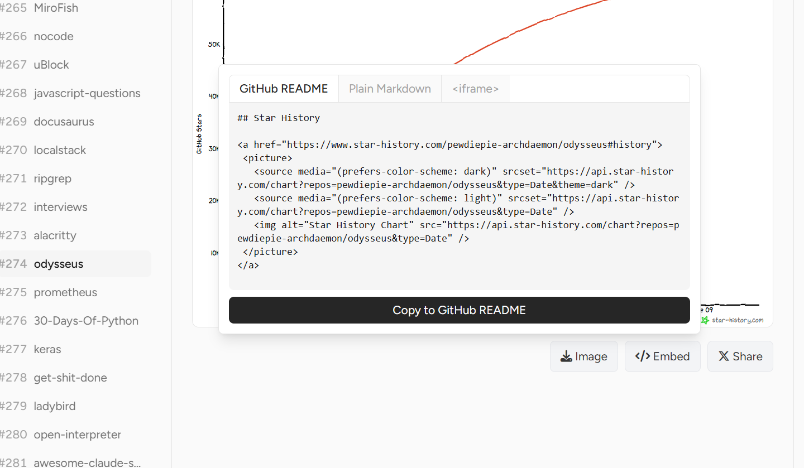

+++
date = '2026-06-01T16:01:32+08:00'
draft = false
title = '如何装修你的 GitHub 主页？免费在线工具一键生成精美 Profile'
tags = ['GitHub', 'GitHub Profile', 'README', '开源', 'Git', '个人主页']
description = '手把手教你装修 GitHub 个人主页，介绍左侧资料区与右侧 README 区的配置方法，推荐 GPRM、Capsule Render 等免费在线工具，快速生成精美的 GitHub Profile。'
categories = ['git教程']
+++

分享一下，如何装修github主页。

先看主页左侧区域的装修方式。

## 1、左侧区域

找到profile，点击头像进来。

Name ----- 可以填真实姓名或者其它姓名。

邮箱 ----- 填写一个合适的邮箱，并且，邮箱配置需要配置为public。

bio ----- 个人简介，个人技能。

pronouns ----- 人称代词，不用管。

url ----- 个人主页，例如，博客。

social accounts ----- 社交帐号。

ORCID iD ----- 跟学术相关的信息，不用管。

## 2、右侧区域

接下来，我们看一下右侧区域该如何装饰。

先创建一个跟自己账号同名的git仓库。

使用markdown语法，编辑这个仓库的readme。

编辑完成，提交之后，就可以在主页看到你的成果了。

除了自己手动编写之外，推荐大家使用在线工具生成主页内容。

在线工具如下：

- [GRPM](https://gprm.itsvg.in/) 填写信息，勾选想要的组件，直接复制生成的 Markdown

- [GitHub Profile README Generator](https://rahuldkjain.github.io/github-profile-readme-generator/) 老牌生成器，选项很全，技术栈、社交链接、Stats 都能加

- [Capsule Render](https://github.com/kyechan99/capsule-render) 生成各种样式的彩色头图/尾图

- [github-profile-header-generator](https://leviarista.github.io/github-profile-header-generator) 专门做顶部 Banner 图

- [ProfileMe.dev](https://www.profileme.dev/) 界面好看，实时预览效果

除了个人主页外，开源项目的 README 文件，也可以使用工具可以在线生成。

- [readme.so](https://readme.so/) 拖拽式编辑，非常方便。

另外，如果想添加这个star增长记录图，可以使用下面这个在线工具生成。

- [star增长曲线记录](https://www.star-history.com/)

将图片对应的代码，嵌入到readme文件里面就可以了。

---

OK，以上就是本期分享。请动手尝试一下。

