+++
date = '2026-05-11T09:08:20+08:00'
draft = false
title = 'OBS Studio 录屏教程：安装配置+镜头跟随/抠图/蒙版插件使用指南'
tags = ["OBS", "录屏软件", "OBS插件", "视频录制", "摄像头抠图", "自媒体工具", "zoom-to-mouse", "obs-backgroundremoval"]
description = '详细介绍 OBS Studio 的安装与配置方法，包括场景设置、录屏、麦克风和摄像头配置，以及3款实用插件：镜头跟随放大（Zoom-to-mouse）、摄像头背景抠图（obs-backgroundremoval）和摄像头圆形蒙版效果，适合做自媒体视频的朋友参考。'
categories = ['IT杂谈']
+++

OBS 软件，功能强大，不仅有基础的录屏功能，还有人物背景去除、镜头跟随鼠标、蒙版抠图等功能。

配置也十分简单。


## 1、安装和配置

### 1.1 下载安装

必应搜索 `obs官网`，找到官网，找到下载，找到适配的系统，点击下载即可。

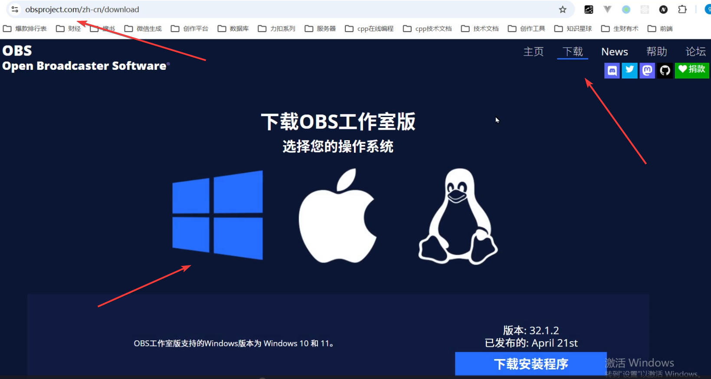

安装的时候，一路点击下一步即可。

### 1.2 配置场景

左下角配置场景。

场景 —— 专门用来切分不同的录制需求。

点击加号，输入场景名称，例如：`录制视频`。

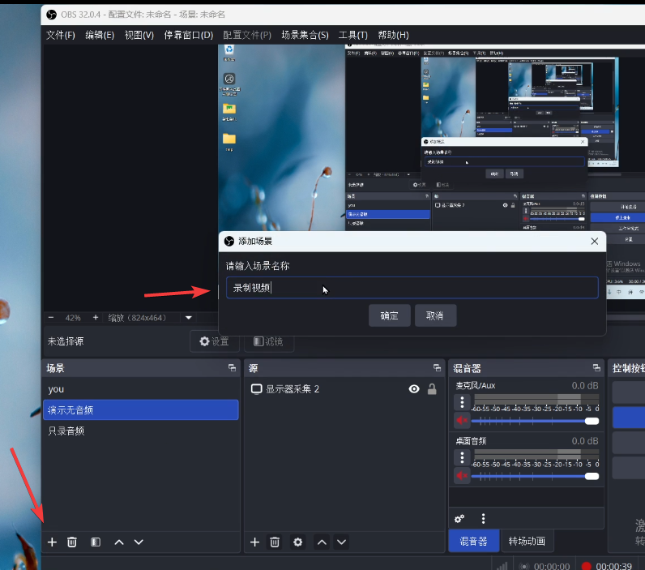

点击确定，添加成功。

### 1.3 配置录屏

点击加号，点击显示器采集

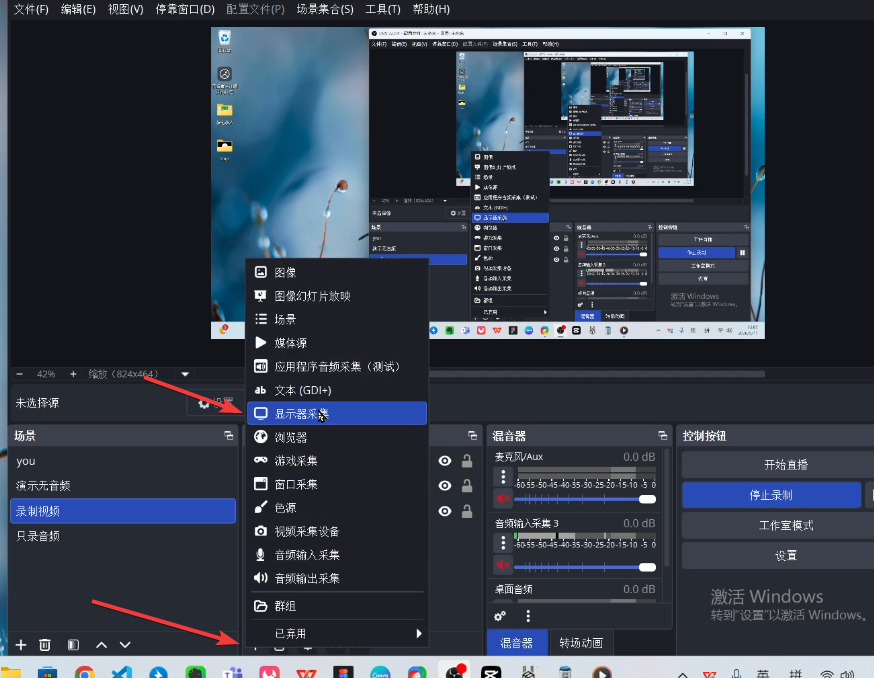

双击刚添加的“显示器采集”，配置你的显示器。

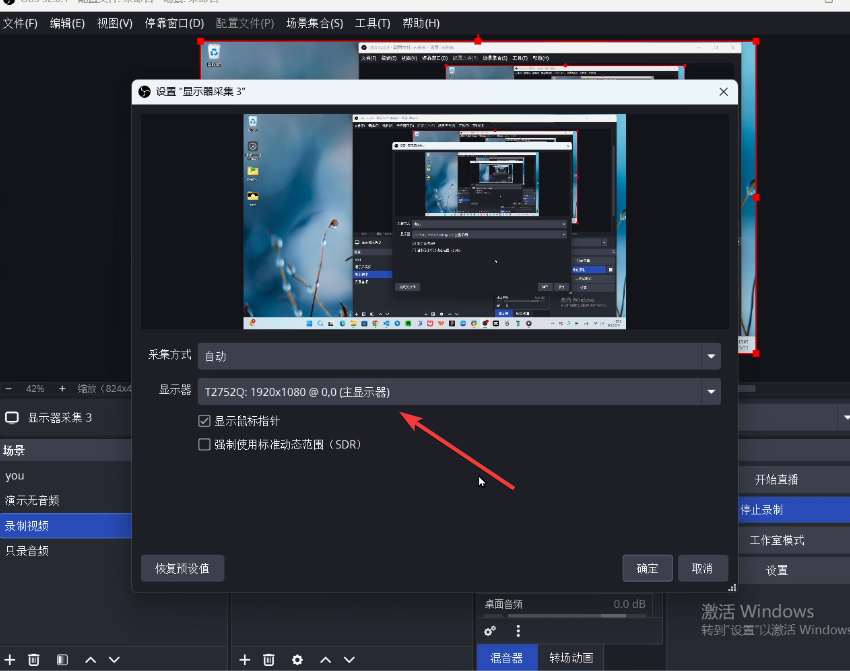

点击确定，添加成功。

### 1.4 配置麦克风

在“源”这里点击加号，选择音频输入采集，添加音频源。

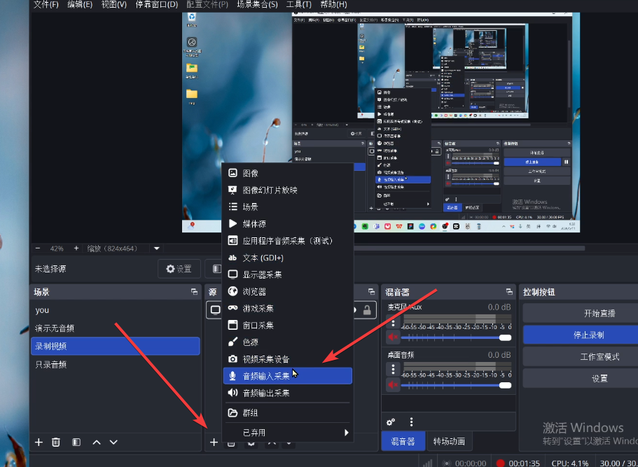

选择你的麦克风设备，确定即配置完成。

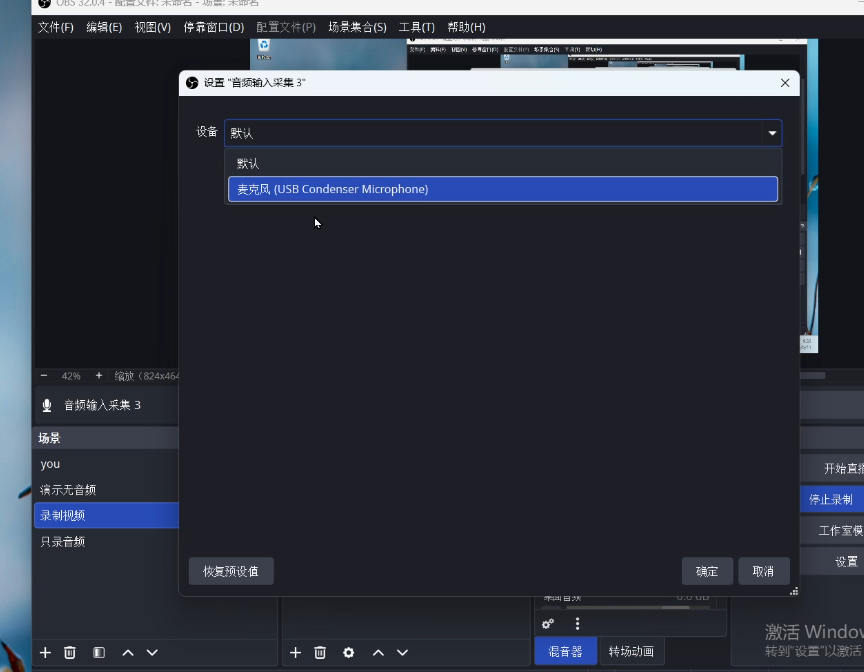

### 1.5 配置摄像头

同样在加号这里，添加视频采集设备。

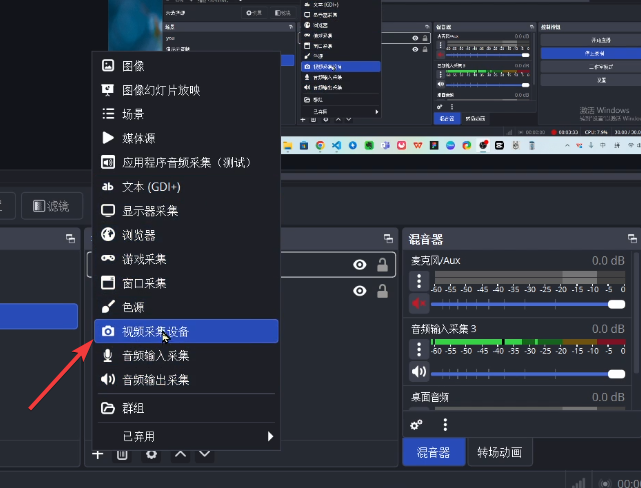

选择可用设备，点击确定即可添加成功。

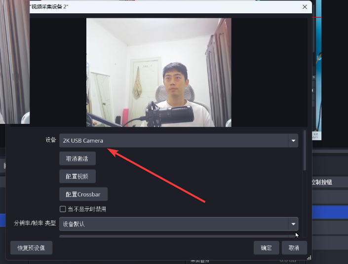

### 1.6 录制

以上配置完成之后，点击右侧的“开始录制”，就可以进行录制了。

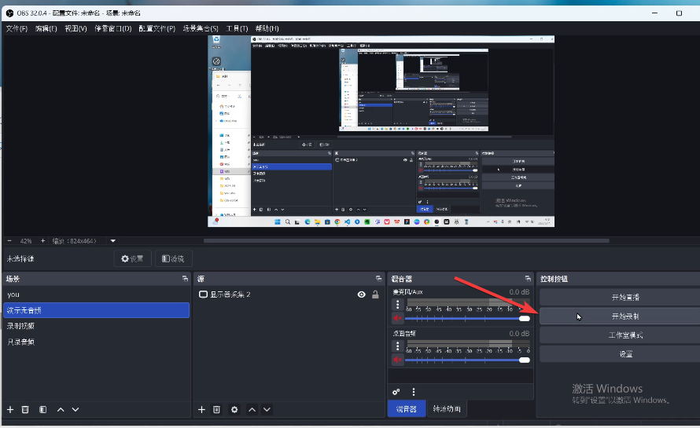

点击“停止录制”，录制的视频就会保存在`设置-输出-录制路径`的文件夹下。

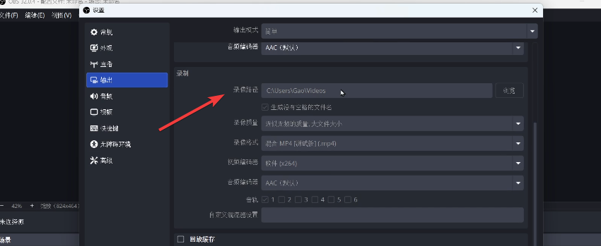

## 2、安装和使用插件

除了上述基础功能外，再分享3个超级好用的插件。

### 2.1 镜头跟随

录屏的时候，希望屏幕能跟随鼠标指针放大、移动，可以使用`Zoom-to-mouse插件`。

在开源社区找到这个项目，将 lua 脚本文件下载下来。

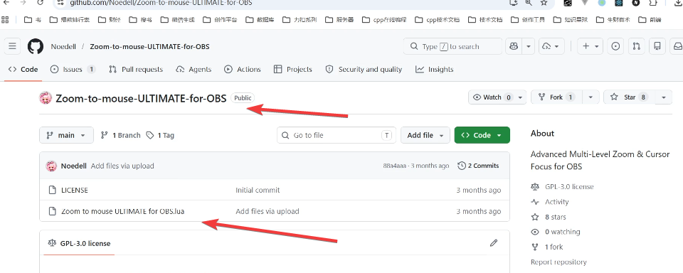

打开obs，配置刚才下载的脚本。

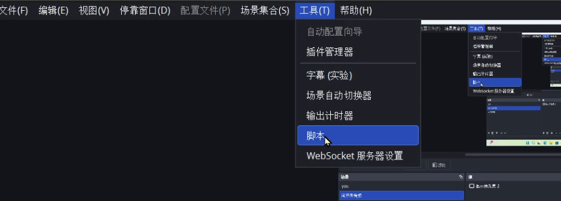

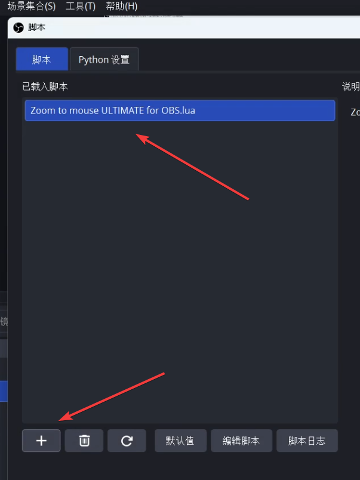

选择显示器，其它数值建议如下

```
zoom factor：1.80 // 放大倍数
zoom speed(in): 0.8  // 放大速度 
zoom speed(out): 0.8 // 缩小速度
```

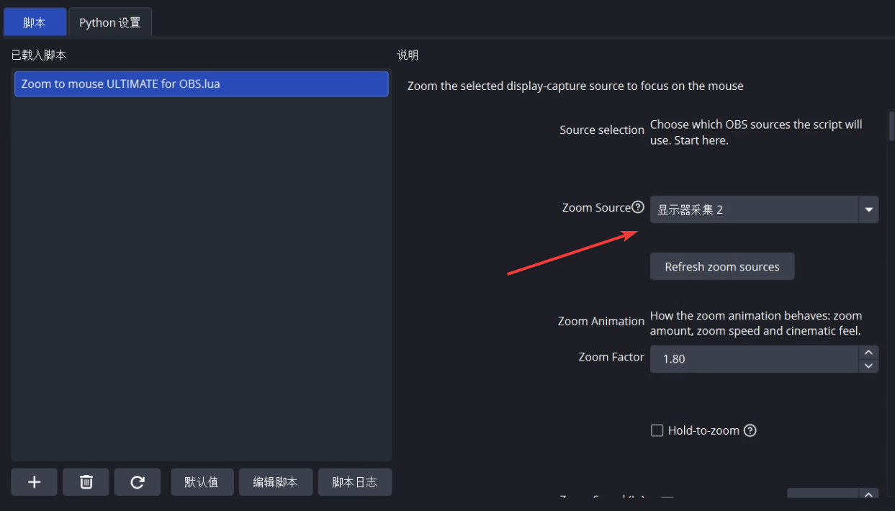

在`设置-快捷键` 筛选 zoom ，配置 `ctrl+1` 和 `ctrl+2`。

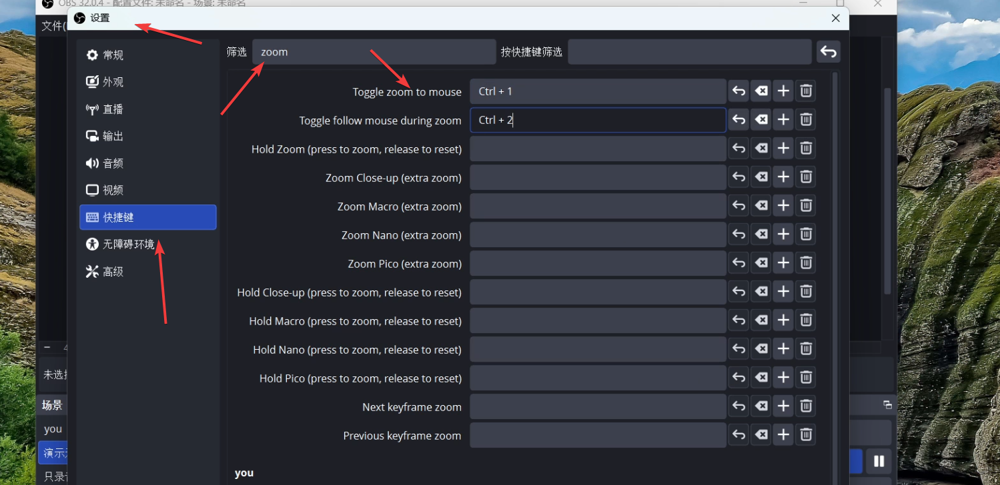

当你录制屏幕的时候，按住 `ctrl+1` 就会放大和缩小屏幕，按住 `ctrl+2` 就会锁定放大后的屏幕，保持不变。


### 2.2 背景去除

录制视频的时候，你可能想要这种效果。

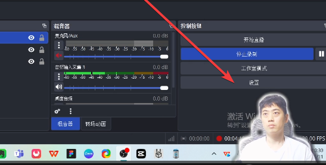

在 github 开源社区，找到 obs-backgroundremoval 项目，将它下载下来。

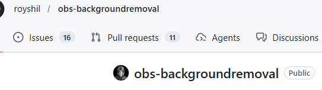

将插件 `obs-backgroundremoval-1.3.7-windows-x64\obs-backgroundremoval\bin\64bit` 路径下的 `obs-backgroundremoval.dll` 文件，拷贝至本机 OBS 的安装路径 `OBS-Studio-32.0.4-Windows-x64\obs-plugins\64bit` 下。

在本机 OBS 的安装路径 `OBS-Studio-32.0.4-Windows-x64\data\obs-plugins\` 下，新建 `obs-backgroundremoval` 文件夹。

将插件 `obs-backgroundremoval-1.3.7-windows-x64\obs-backgroundremoval\data` 文件夹下的这些内容全部拷贝至刚才创建的目录下。

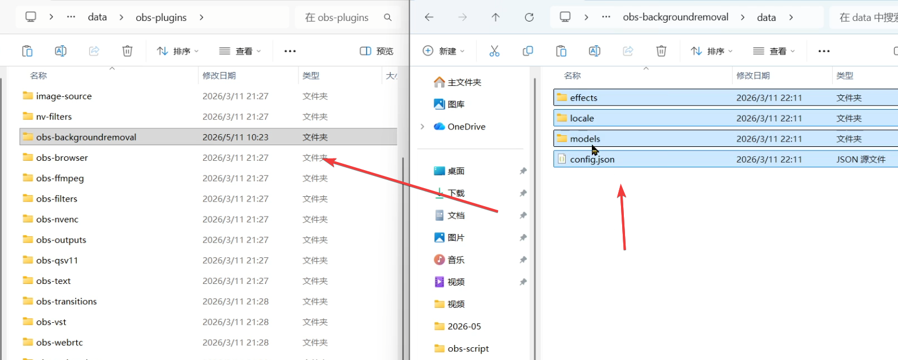

选择视频采集，选择滤镜。

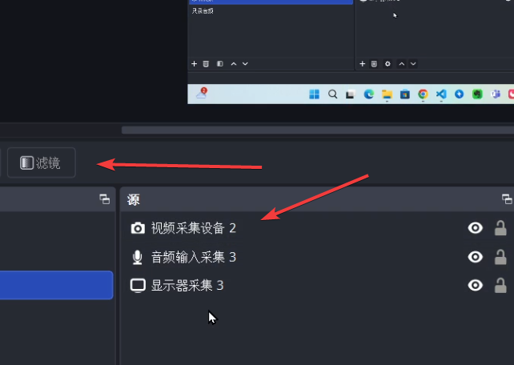

点击加号，添加背景去除，配置OK。

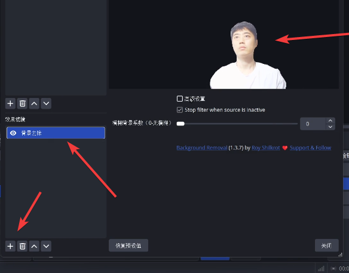

> 配置参数如下

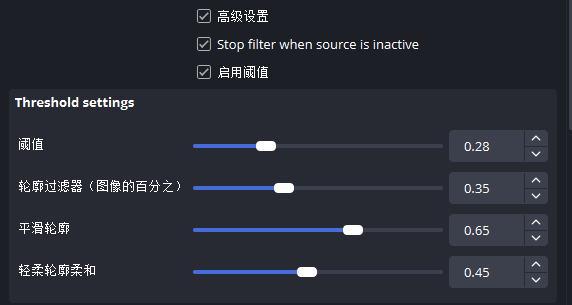
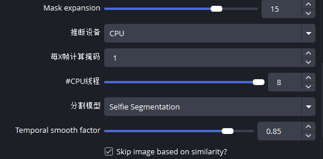
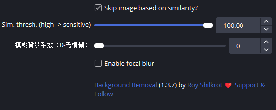

### 2.3 摄像头蒙版

有些朋友可能喜欢这种效果。

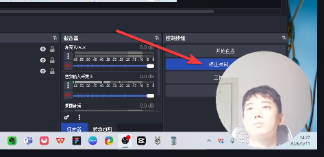

直接用 windows 画图工具，做个这样子的图。

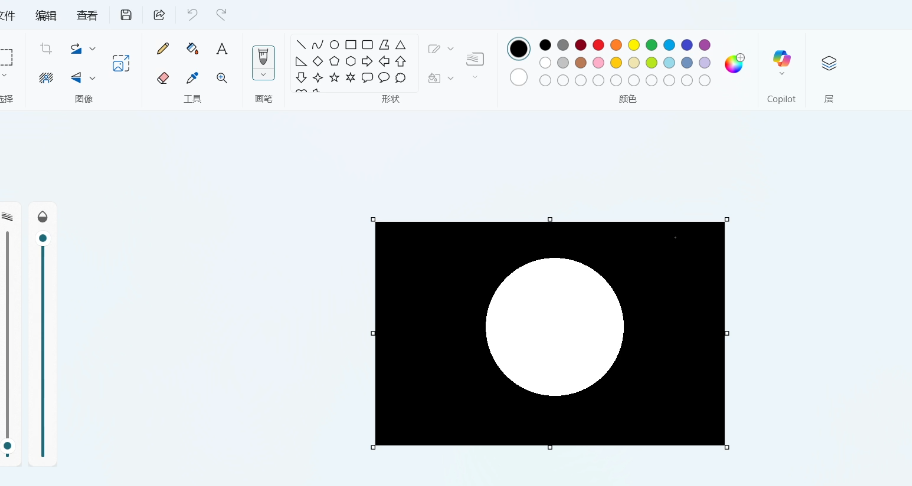

在`视频采集设备-滤镜`这里，去掉 `背景去除`（如果有的话），添加`图像蒙版/混合`

路径这里选择刚才制作的白圈图片，类型选择`Alpha蒙版（颜色通道）`，即可配置成功。

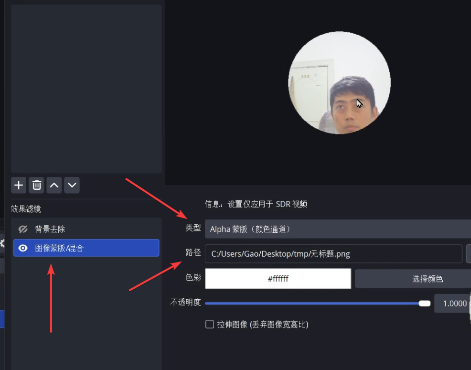

---

以上就是本期分享，希望能给您带来思考和帮助。也希望您能点赞关注支持一下，您的支持是本频道更新的最大动力。下期再见。