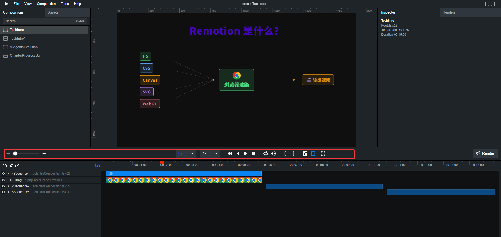
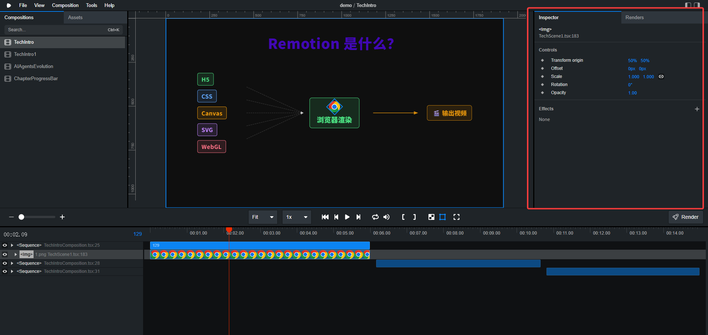
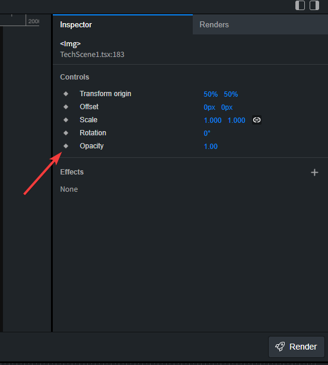
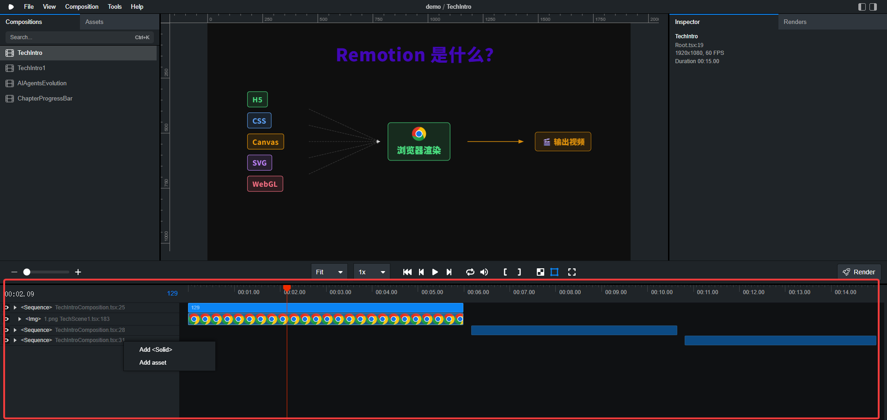
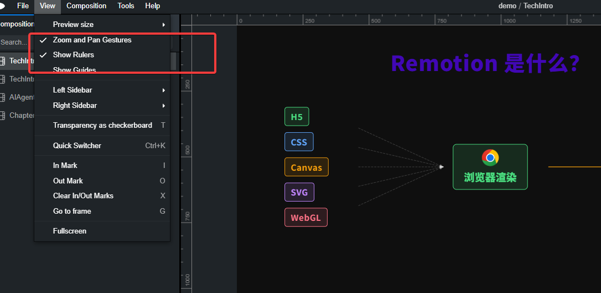
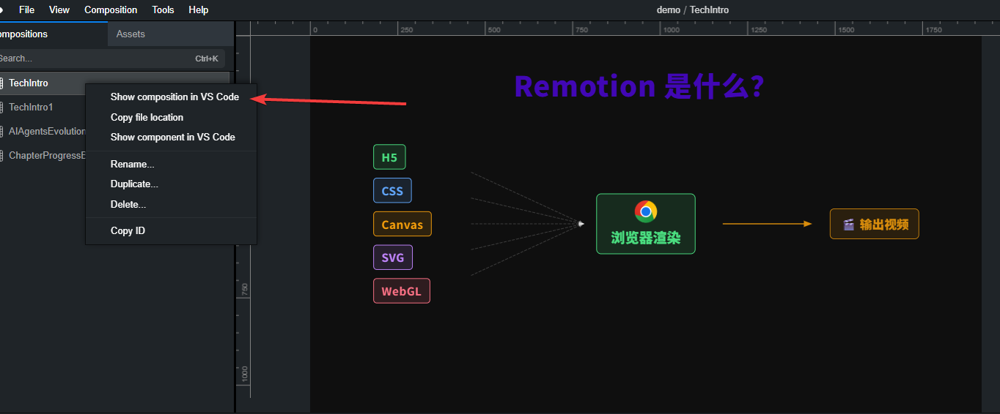
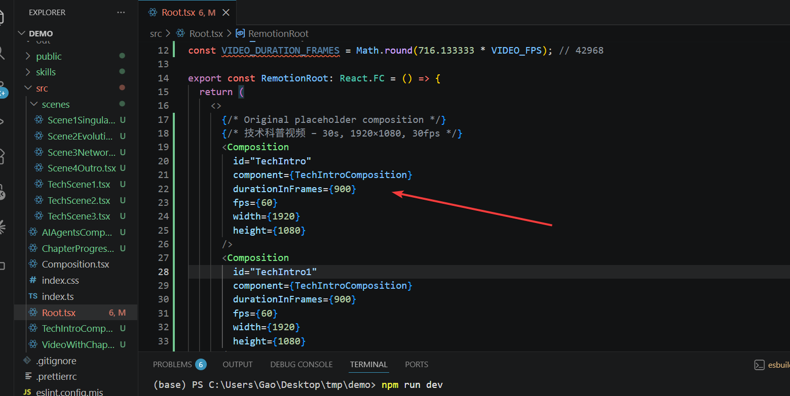
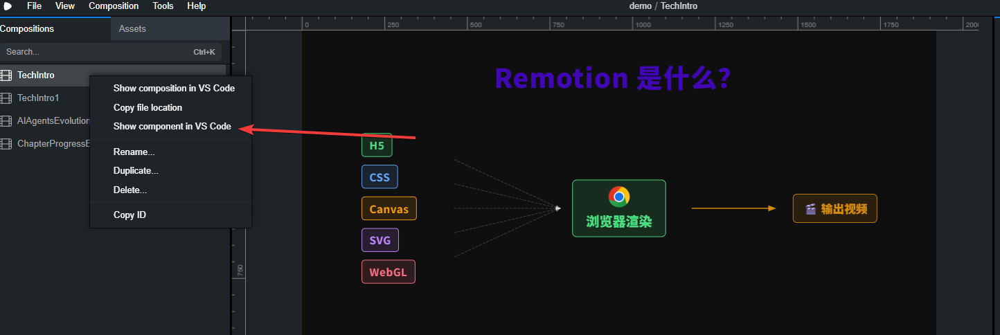
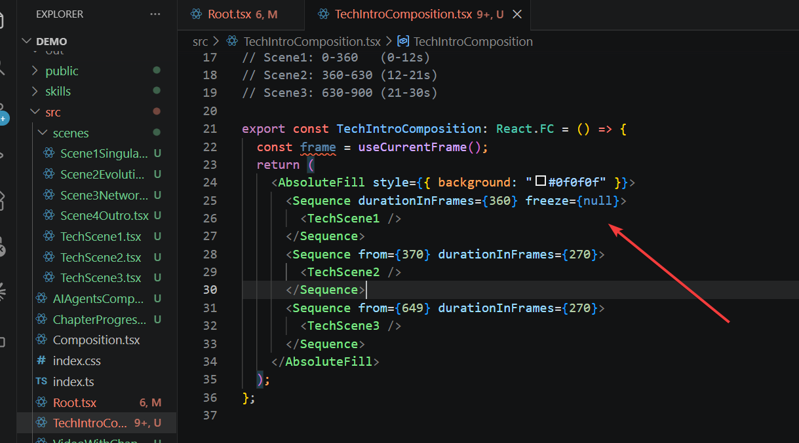
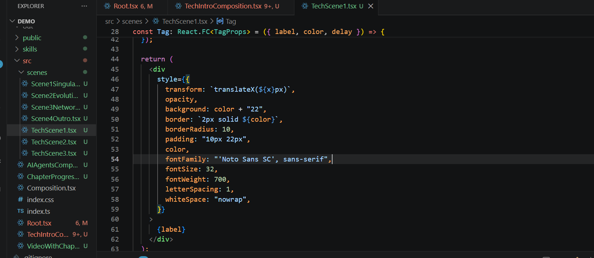

+++
date = '2026-06-22T14:11:15+08:00'
draft = false
title = 'Remotion 工作台面板详解：关键帧设置与代码微调教程'
tags = ['Remotion', '视频制作', '关键帧', '代码教程', 'AI视频']
description = '全面讲解 Remotion 工作台各面板功能，包括 layout、transform、关键帧添加方法，以及如何通过代码或 AI 微调视频效果，适合零基础用户快速上手。'
categories = ['remotion']
+++

今天分享一下 remotion 面板功能，以及如何通过代码微调视频元素。

建议先看之前的[视频](https://youtu.be/srW1Jnm1N2U)，视频介绍了 remotion 初级使用方法。

以下为文档内容，也可以点击[视频]()观看讲解。

## 1、面板介绍和关键帧。

“- +” - 调整轨道的大小。

“fit” - 放大、缩小画布。

“1x” - 调整播放速度。

"[ ]" - 隐藏当前位置的左、右区域，会影响导出视频。

“棋盘格” - 显示透明区域。

“方块” - 选中画布中的元素。

当我们选中画布中的元素之后，可以对其进行调整。

---

右侧是调整面板。

layout - 自动填充、自定义调整。

transform origin - 圆心位置调整位移。

offset - 移动。

scale - 放大缩小、是否按照比例。

rotation - 旋转。

Opacity - 透明度。

Premount For - 预加载。

预加载的意思是，提前挂起这个组件。瑜伽在功能，可避免：

- 开头几帧黑屏
- 图片闪烁一下才出现
- 字体跳变

effects - 添加特效。例如，uvTranslate() 移动特效。通过关键帧，看到实际效果。

点击菱形，可以添加关键帧和取消关键帧。

---

下半部可以选择视频轨道和视频片段。

小眼睛 - 隐藏/显示视频。

小三角 - 调整元素的布局。

轨道右键freeze - 定格某一帧图片。

轨道右键add solid - 添加背景。

轨道右键add assets - 添加其它元素，例如，图片。

长按可以拖动轨道，上下拖动，调整它们的顺序，左右拖动，调整进度。

---

view栏的两个选项，建议勾选。

第一个选项 zoom and pan gestures , 勾选后，按住 ctrl 加鼠标滚轮，可以调整画布大小。

第二个选项 show rulers，勾选后，画布会增加标尺。

## 2、如何调整 remotion 代码

选中视频，右键show composition，会跳转到 root.tsx 代码文件。

root 文件，会声明 remotion 中的所有视频项目。

root 文件，可以调整帧率、宽高。

选中视频，右键点击 show component，会跳转到该视频的代码文件。

每对 sequence 对应一个视频片段。

每对 sequence 包裹着视频的具体代码片段。

“F12” 可以跳转进入该代码片段中，搜索需要修改的具体内容，在 “style” 中，进行微调即可。

如果不会调整，可以把想法告诉 ai 来解决。

---

以上就是本期分享，感谢阅读。