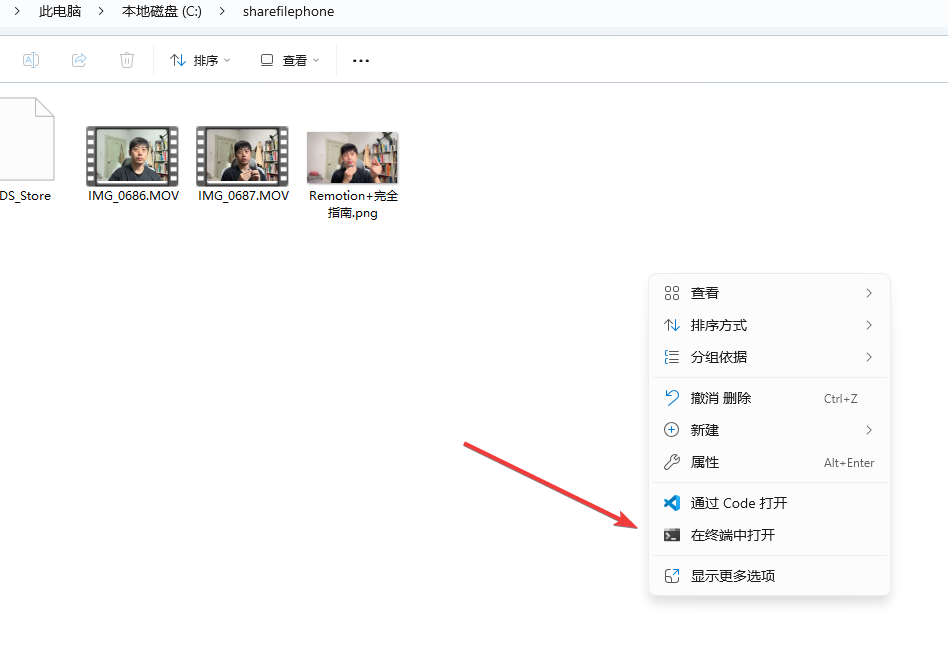
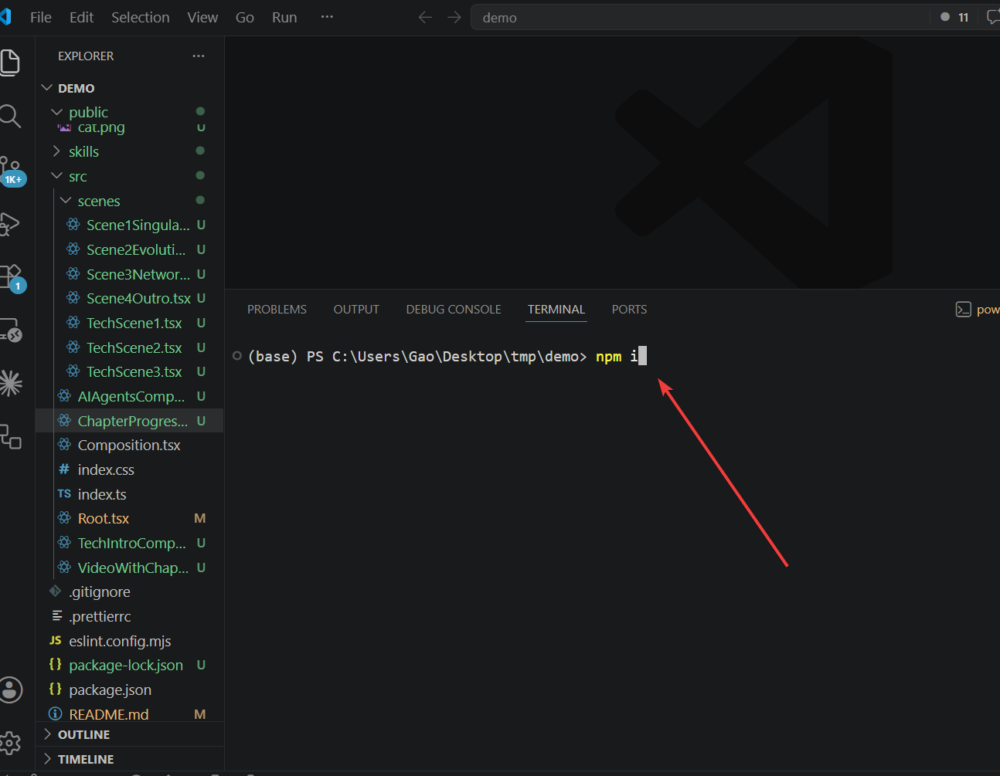
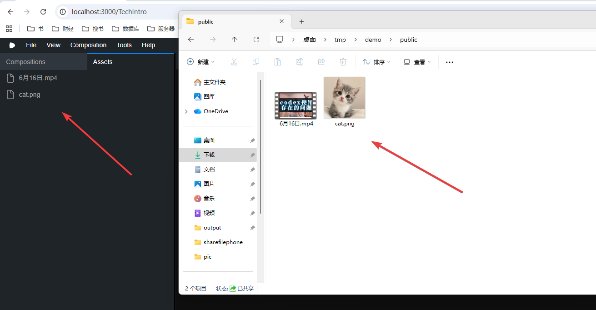
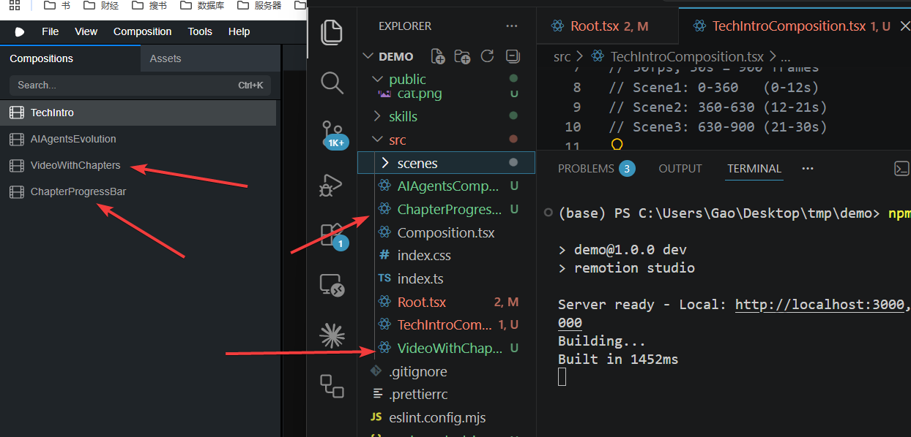
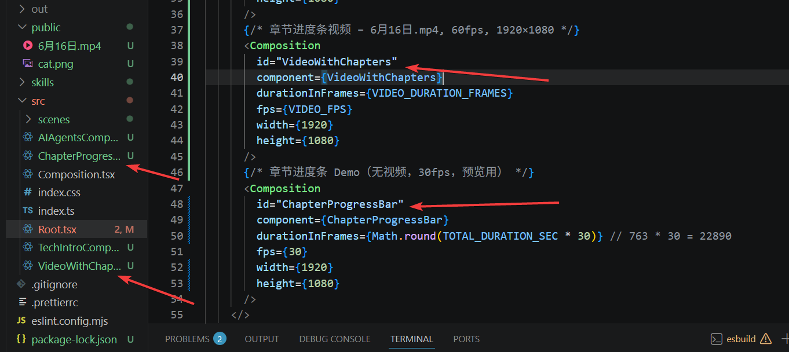
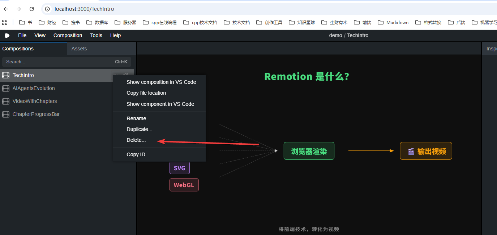

+++
date = '2026-06-05T16:19:47+08:00'
draft = false
title = 'Remotion完全指南：用React代码生成视频的前端框架教程'
tags = ['Remotion', '视频制作', 'React', 'TypeScript', '前端开发', '视频编程', 'AI辅助开发', '代码生成视频', 'Web开发']
description = '深入了解Remotion视频框架：一个基于React的程序化视频制作工具。本教程详细讲解Remotion是什么、如何安装配置、项目结构解析，以及如何使用AI工具结合Remotion快速创建动态视频。适合前端开发者学习用代码制作专业视频。'
categories = ['ai相关']
+++

今天的文章，分享一下remotion工具。

以下是文字内容，也请参考[视频演示](https://youtu.be/srW1Jnm1N2U)。

## 1、remotion 是什么

remotion 不是 ai 工具，不是 ai 大模型。

它是一个代码开发的框架，借助H5、 CSS、Canvas、SVG、WebGL 等前端技术，将图形、文字、图片等元素，通过浏览器渲染出来，让用户看到动态效果，最后，再把这些动态效果，转化为视频。

即便 ai 技术消失了，remotion 仍然可以做出视频。

## 2、remotion 项目介绍

保证系统安装的 node 版本 >= 20。

找到一个空文件夹，用命令行终端打开。



在命令行终端执行，如下指令：

```
npx create-video@latest

```

如果出现报错，请在命令行输入以下指令，配置代理

```
$env:HTTP_PROXY="http://127.0.0.1:代理端口"
$env:HTTPS_PROXY="http://127.0.0.1:代理段口" 
```


所有选项选择默认即可。

使用 vscode 打开项目。

输入：

```
npm i 下载三方库。

npm run dev 打开 remotion studio 工作站。
```




remotion项目中的文件夹对应关系如下：

| 文件夹 | 对应工具 |
|--------|----------|
| .agent / .agents | VS Code Copilot Agent / 通用 agent 配置 |
| .claude | [Claude Code](https://claude.ai/code)（Anthropic） |
| .cline | [Cline](https://github.com/cline/cline)（VS Code 插件） |
| .codex | [OpenAI Codex CLI](https://github.com/openai/codex) |
| .cursor | [Cursor](https://cursor.sh/)（AI IDE） |
| .windsurf | [Windsurf](https://codeium.com/windsurf)（Codeium 的 AI IDE） |
| .continue | [Continue](https://continue.dev/)（VS Code 插件） |
| .gemini | [Gemini CLI](https://github.com/google-gemini/gemini-cli)（Google） |
| .roo | [Roo Code](https://roocode.com/)（VS Code 插件） |
| .trae | [Trae](https://www.trae.ai/)（字节跳动 AI IDE） |
| .goose | [Goose](https://github.com/block/goose)（Block/Square） |
| .openhands | [OpenHands](https://github.com/All-Hands-AI/OpenHands)（原 OpenDevin） |
| .kiro | [Kiro](https://kiro.dev/)（AWS） |
| .qwen | 通义千问相关工具 |
| .mcpjam | MCP（Model Context Protocol）相关工具 |
| .factory | [Factory](https://www.factory.ai/) |
| .crush / .pi / .pochi 等 | 其他 AI 编程工具 |


其它目录：

public - 存放公共资源（例如，待加工的视频，图片……）

skills - skill原生目录，remotion官方维护的skill

src — 制作视频的源码

其它的文件是配置相关的文件，以及项目说明文件。

## 3、remotion使用

在 vscode ai 插件的对话框中，输入提示词：

```
你是一个精通 React、TypeScript 和最新版 Remotion 视频框架的顶级 Motion Designer。
我需要你编写一个 15 秒（fps=30，共 450 帧）、分辨率为 1920x1080 的科技感 AI 主题视频。

【主题】
《AI 代理演进史：从 Prompt 到自主 Agent》

【视频结构与分镜】
1. 0 - 3 秒（0-90帧）：【前言：数据奇点】
   - 背景：深黑色 canvas，带有逐渐亮起的动态科技网格（使用 SVG 绘制）。
   - 动画：居中显示大标题“AI AGENTS”，字母间距由散开逐渐收拢，并伴随模糊（blur）渐变消退的效果。
2. 3 - 8 秒（90-240帧）：【进化：从 Prompt 到智能化】
   - 画面左侧：展示一段打字机效果的代码流（模拟 Prompt 交互），文字逐字蹦出。
   - 画面右侧：一个 3D 质感的圆形粒子球（使用 CSS 或 Canvas），随着“代码”的输入，粒子球的半径、旋转速度和颜色（从冷蓝到极光紫）发生明显的“激活”变化。
3. 8 - 13 秒（240-390帧）：【多 Agent 协作网络】
   - 核心效果：画面中央展开一个包含 3 个节点的拓扑图（AI 主控、数据分析、代码执行）。
   - 动画：节点与节点之间有发光的数据流线条（Dash-offset 动画）在快速穿梭。各节点伴随弹簧动画（spring）依次放大并产生呼吸光晕。
4. 13 - 15 秒（390-450帧）：【片尾：未来已来】
   - 画面淡出：背景网格亮度降低。
   - 结算特效：一个科技感十足的进度条（0% 飞速加载到 100%），上方浮现文案 “The Future is Programmatic.”。

【必须体现的 Remotion 核心用法与高级技术指标】
- 使用  绝对定位构建多层画布。
- 必须使用  精准控制上述 4 个分镜的入场、出场和时间重叠。
- 严禁硬编码（Hardcode）动画数值。所有动画必须由 `useCurrentFrame()` 驱动。
- 运用 `interpolate` 实现复合属性联动，例如将 frame 映射到：opacity [0 to 1], scale [0.5 to 1], filter [blur(10px) to blur(0px)]。
- 运用 `spring` 物理引擎函数（设置 config: { damping: 12, mass: 0.5 }），为节点诞生、弹窗弹出赋予极度丝滑的 Q 弹果冻感动画。
- 所有非本地资源（若用到网络图片或字体）必须使用 Remotion 内置的 `` 组件，防止渲染时出现首帧闪烁。
- 代码结构清晰，将各个分镜抽象为独立的子组件，并使用 TypeScript 规范定义 Props 接口以体现 Remotion 的可复用性和参数化（Parameterized）特性。
```

---

在 public 目录下的视频中，添加进度条的提示词：

```
我在public里面增加了一个视频，请帮我制作章节进度条，进度条在视频上方。

第一章: 0 - 1:10，入门介绍；

第二章: 1:10-2:30，高级介绍；

第三章: 2:30-4:00，实战；

第四章:4:00-结尾，总结。
```

该方法，导出视频的时间长，可能需要几个小时。

---


单独做进度条，提示词如下：

```
我希望制作一个视频的进度条，视频的总时长为4分钟。目前，还没有这个视频。请先将进度条做出来。

信息如下：

第一章: 0 - 1:10，项目介绍；

第二章: 1:10-2:30，基础操作；

第三章: 2:30-4:00，实战；
```

该方法导出时间短，需要单独将进度条效果放到剪辑工具中处理。

## 4、remotion 目录结构梳理

工作台 assets ，对应 public 目录下的内容。



工作台 Compositions，对应 src 目录下的内容。



root 文件中，聚合了视频源代码的组件，这些组件可以找到同名的代码文件。



单独的视频项目，用完之后，点击删除即可。



如果视频条目过多，或该 remotion 项目内的代码过于冗长，删除该 remotion 项目即可。

重新输入指令，创建一个新的remotion项目。

-------------

以上就是本期分享，请动手尝试一下。