+++
date = '2026-06-30T09:09:27+08:00'
draft = false
title = 'Remotion vs Hyperframe：AI 视频制作工具深度对比，新手该怎么选？'
tags = ["Remotion", "Hyperframe", "AI视频", "视频制作工具", "前端动画", "Codex", "新手教程"]
description = '本文从初始化配置、AI 提示词生成效果、操作界面、项目管理、视频导出（含透明背景）五个维度，深度对比 Remotion 与 Hyperframe 两款热门的代码驱动 AI 视频制作工具，并给出新手与有编程经验用户的选型建议。'
categories = ['AI相关']
+++

本篇文章讲解hyperframes用法，并从多个角度跟 remotion 工具进行对比。

## 1、项目安装与初始化

hyperframes 环境要求

```
node 版本≥ 22

ffmpeg 版本 ≥ 7

```

node安装，使用nvm工具。

ffmpeg安装，使用如下指令：

```
winget install ffmpeg 
```

hyperframes 安装，使用如下指令，安装过程选择默认选项即可。

```
npx hyperframes init
```

---

remotion 要求 node 版本大于等于 20，无需单独安装 ffmpeg 。

只需要如下指令，即可安装成功。

```
npx create-video@latest
```

- 总结：remotion项目初始化更加方便。

## 2、结合 ai 制作视频

codex 打开，选择 gpt 5.5 模型。

打开上一步骤创建的 hyperframes 项目目录。

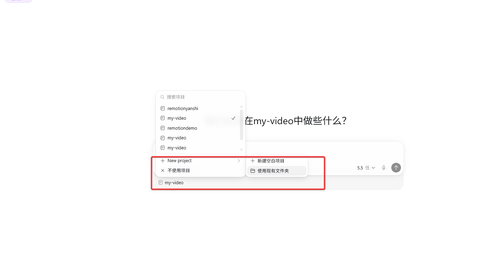

打开之后，输入如下提示词：

```
请先浏览当前的项目，了解技术框架。然后实现一个视频效果：

一行银灰色的文字 - hi there！This is demo! 逐渐放大，放大到一定程度之后，变一种颜色。

你只需要创建代码即可，不需要执行任何指令，我自己来验证效果。
```

- 总结：经测试，同样的 ai 工具，同样的 ai 大模型，同样的提示词。

hyperframes 做出的视频更有质感, 视频时间较长 10s 左右。

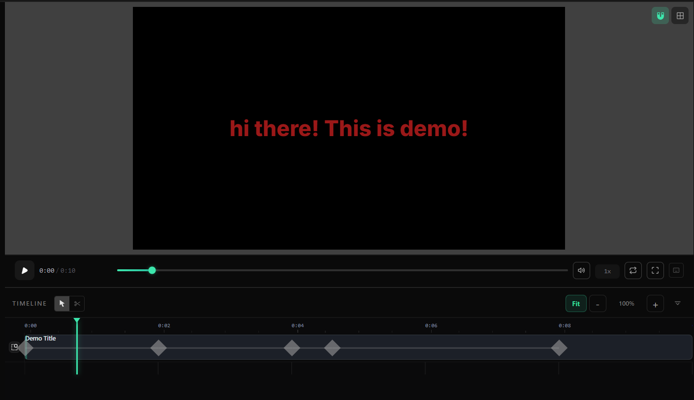

remotion 做出的视频粗糙，视频时间较短 2s 左右。

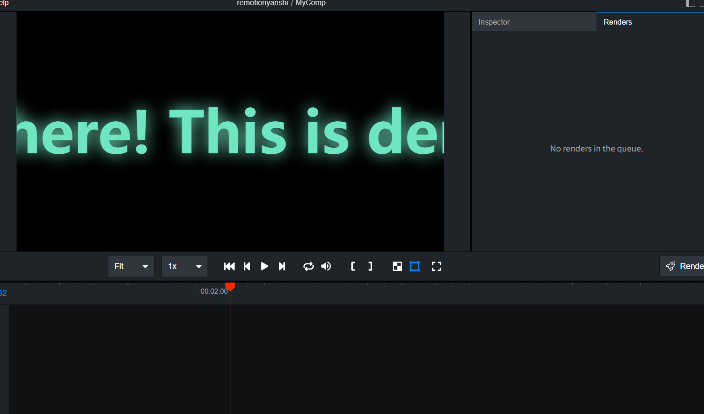


## 3、操作界面

hyperframes 的界面，内容丰富。

左侧，可直接修改代码；左侧有社区功能，可以直接拷贝别人做好的提示词。

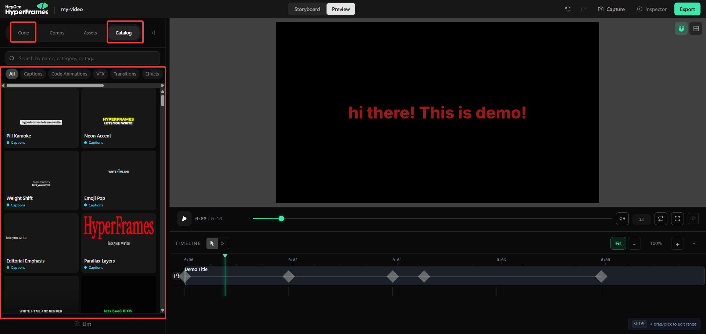

右侧，可以选择图层，编辑、调整、优化视频内容。

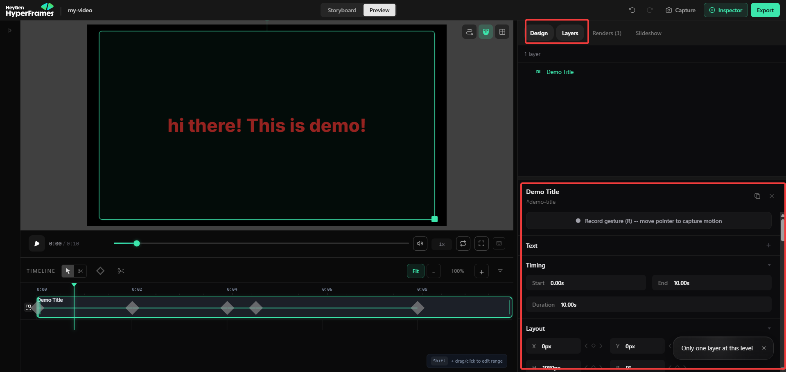

---

remotion 工作台简陋，只有基础功能，无法直接修改视频内容。

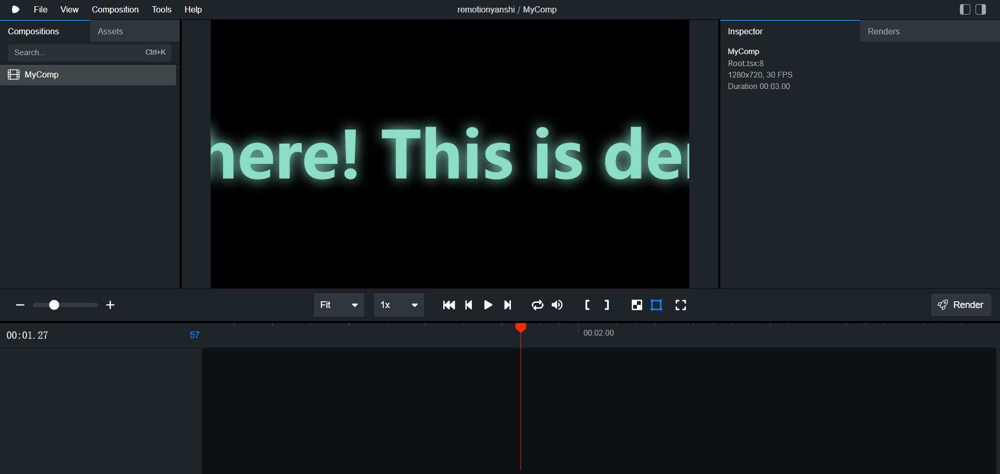

- 总结：hyperframes 操作界面元素丰富，做得更好。

## 4、项目管理

hyperframes 项目，将依赖的三方库文件，下载到 c 盘，占用磁盘空间，不好管理。

```
C:\Users\Gao\AppData\Local\npm-cache\_npx\28cb90d26e8fb0bf\node_modules\hyperframes\dist
```

hyperframes 工作台，仅能看到一个视频。该视频由 index.html 文件生成。

不允许存在其它视频对应的代码文件。

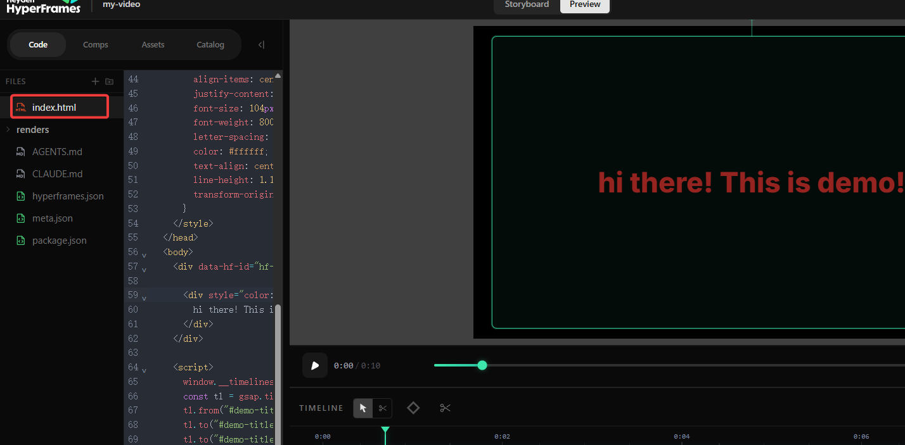

---

remotion 项目，所有代码均放在项目文件夹中，不会下载到c盘。

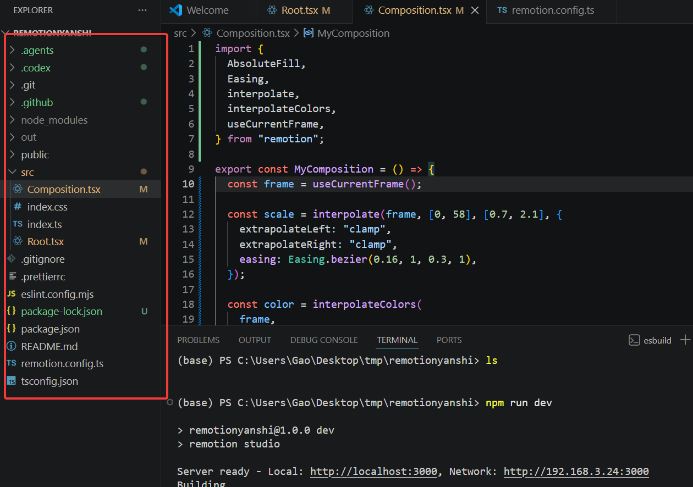

remotion 工作台，可以查看多个视频，项目中允许存在不同的视频代码。

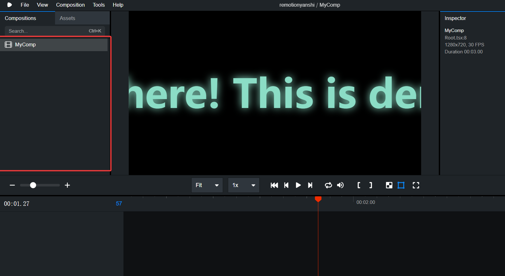

总结：remotion项目更好管理。

## 5、视频导出

hyperframes 导出视频，有三个下拉框，选项条目少，简单清晰。

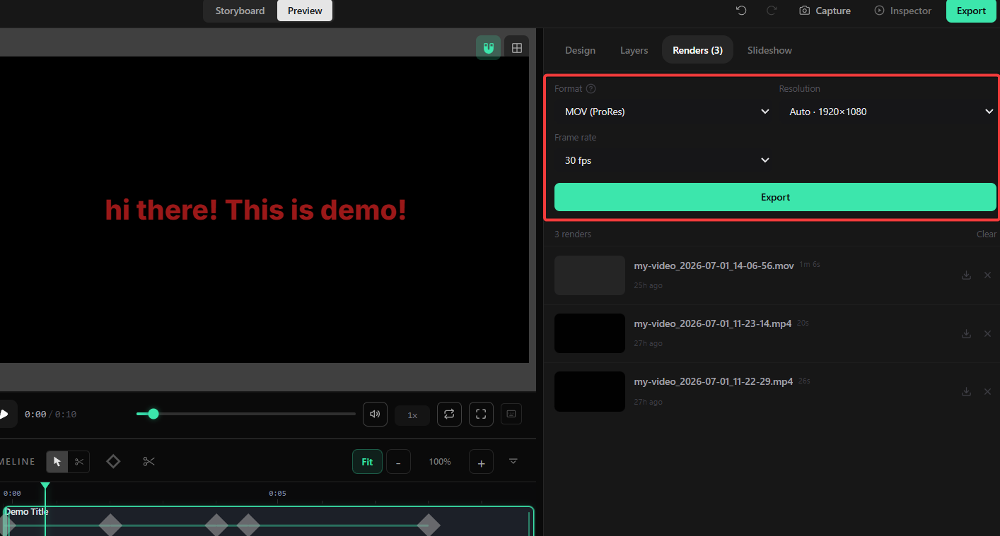

---

remotion 导出视频复杂，会有多个配置项参与。

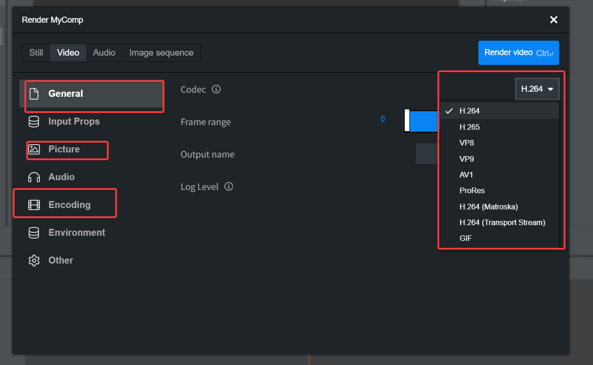

总结：hyperframes 导出视频更加方便。

---

最后总结：hyperframes 适合所有人（不论懂不懂代码）使用；remotion更适合懂编程的人使用。

请大家自行尝试使用。