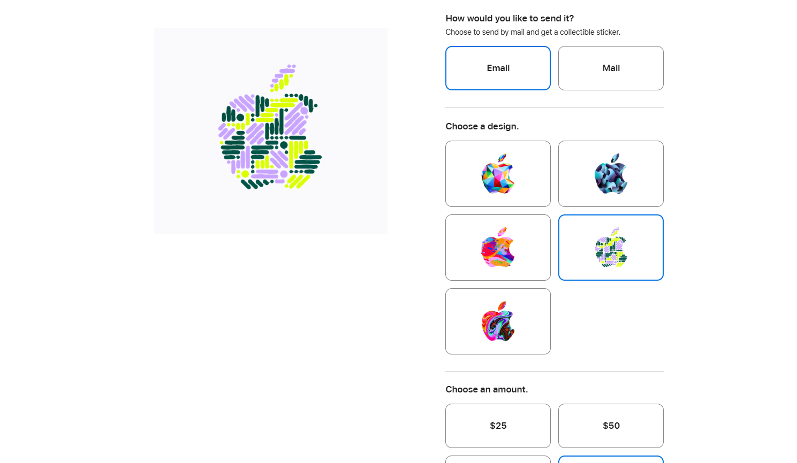
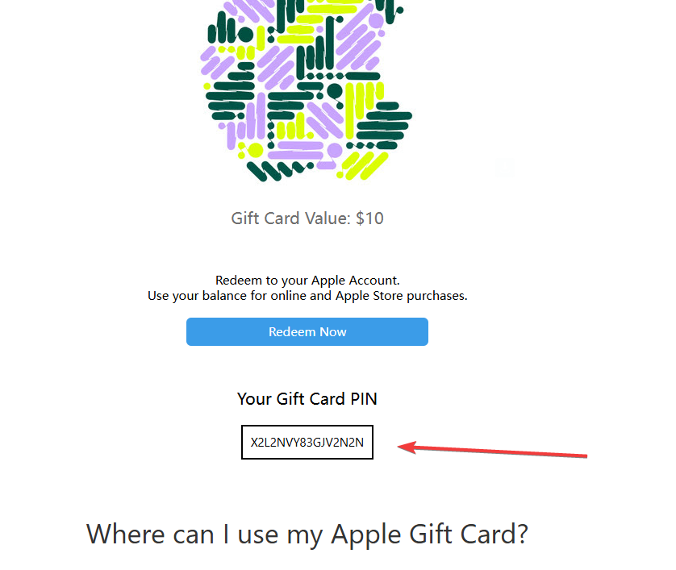
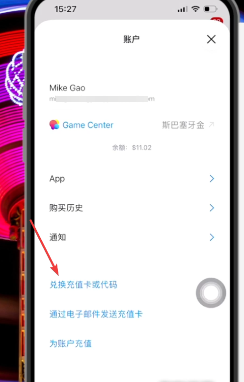

+++
date = '2026-06-15T14:23:03+08:00'
draft = false
title = '如何用苹果礼品卡订阅 OpenAI Codex 会员（官方渠道教程）'
tags = ['Codex', 'OpenAI', 'ChatGPT', '苹果礼品卡', '美区Apple ID', 'AI工具', '订阅教程']
description = '手把手教你通过官方渠道购买苹果礼品卡，充值美区 Apple ID，订阅 OpenAI Codex / ChatGPT Plus 会员。全程安全合规，附招商银行全币种 Visa 信用卡填写技巧与免税州选择建议。'
categories = ['AI相关']
+++

如何使用官方渠道购买苹果礼品卡，来订阅codex会员。

前期准备：

1. 招商银行的全币种 visa 信用卡。

2. gmail邮箱接收苹果礼品卡。

3. iphone全程登录美区的账号。

不知道如何注册美区id的朋友，看一下这个分享[《如何注册美区id》](https://youtu.be/yfRsFGqdEKY)。

4. 电脑端和手机端，全程连接外网。

---

具体步骤：

（具体步骤这里，参考[视频分享](https://youtu.be/YveuXwYlmP8)）

第一步，打开苹果官网礼品卡购买[页面](https://www.apple.com/shop/buy-giftcard/giftcard)

第二步，填写表单



1. 选择email，选择皮肤主题，填写金额。

2. 收卡人姓名，填拼音；收卡人 Email 地址，填写 Gmail 邮箱地址，一定不要填错。

发送者姓名，填拼音，内容随意；发送者 Email 地址，填写 QQ 邮箱或者 163 邮箱。

3. 备注信息，随意填写，比如“good”。

4. 点击add to bag；点击 check out。

第三步，输入苹果美区账号的id和密码

第四步，选择第一个 —— 信用卡支付

1. 填写你的信用卡卡号、过期时间、卡背面后三位数字

2. 账单地址，默认的美国 United States;

依次往下填写你的名字(拼音)、你的姓氏（拼音）。

街道、邮编、城市、手机号这些信息，使用[美国地址生成器](https://www.meiguodizhi.com/usa-address/oregon)。

选填下面五个免税州之一：

```
蒙大拿州 Montana

俄勒冈州 Oregon

阿拉斯加州 Alaska

特拉华州 Delaware

新罕布什尔州 New Hampshire

```

3. 填写联系信息 Contact Information

邮箱，填接受礼品卡的 Gmail 邮箱；

电话，填美国地址生成器给的电话。

第五步，所有信息，再次检查没有问题之后，提交订单

等待20分钟，邮箱收到礼品卡。

第六步，打开邮箱里的邮件，把pin码复制下来。



打开appstore，打开美区账户。

点击兑换充值卡，输入复制的pin码，苹果账户充值成功！



第七步，手机端打开 chatgpt app，点击左上角的升级按钮。

选择一个套餐，订阅并付费。

-----------

以上就是本期分享，感谢阅读。
